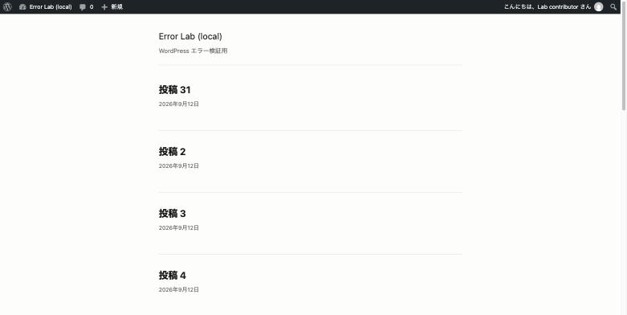
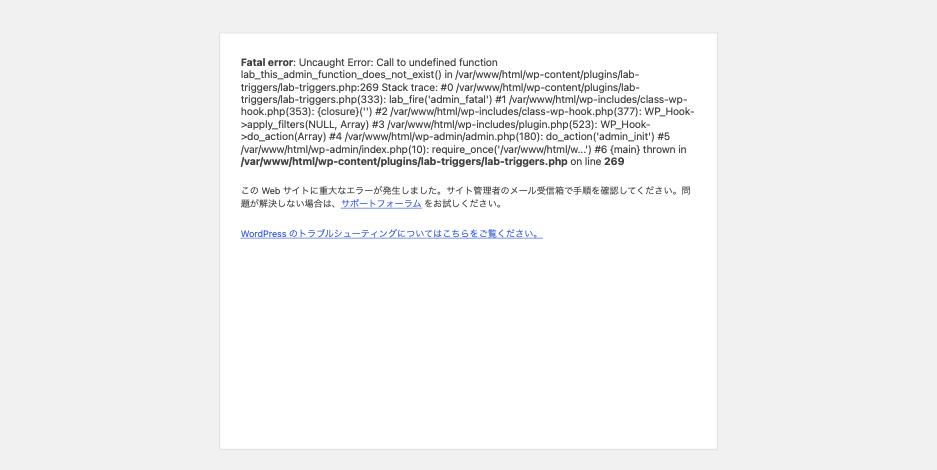

サイトは普通に表示されている。記事も読める。**なのに管理画面だけが真っ白、
または「重大なエラー」になる。**

「サイトが落ちた」ときとは原因の範囲が違います。**フロントが無事という事実が、
そのまま最大の手がかり**になります。実測しました。

## 実測: どこが生きているか

管理画面でだけ Fatal error が起きる状態を作り、各経路を測りました。

| 経路 | HTTP | 本文 |
|---|---|---|
| トップページ | **200** | 25,079 bytes（正常） |
| 個別記事 | **200** | 21,433 bytes（正常） |
| ログイン画面 | **200** | 9,905 bytes（正常） |
| **管理画面（ログイン後）** | — | **Fatal error** |
| REST API | 200 | 正常 |
| **`admin-ajax.php`** | **500** | 473 bytes |

フロント側は完全に無傷です。実際の画面がこれです。





管理画面のメッセージは、フロント側とは文言が違います。

> この Web サイトに重大なエラーが発生しました。**サイト管理者のメール受信箱で
> 手順を確認してください。**

ログイン中の管理者に見せる版で、リカバリーモードのメールに言及しています。

## ここから絞れること

**フロントが 200 で管理画面だけ落ちているなら、原因は管理画面でだけ動くコードです。**

WordPress のプラグインやテーマは、管理画面とフロントで実行されるコードが
分かれています。

| よくある場所 | 説明 |
|---|---|
| `is_admin()` の中の処理 | 管理画面専用の分岐 |
| `admin_init` / `admin_menu` / `admin_enqueue_scripts` フック | 管理画面でだけ動く |
| 設定画面の描画コード | その画面を開いたときだけ動く |
| ダッシュボードウィジェット | ダッシュボードでだけ動く |
| 一覧画面のカラム追加 | 投稿一覧でだけ動く |

**逆に、フロントも落ちているなら `functions.php` の構文エラーや
プラグイン同士の衝突**（読み込み時点で落ちるもの）を疑います。
切り分けの向きが違います。
→ [サイト全体が 500 になっている場合](functions-php-broken-recovery.md)

## 「特定の画面だけ」ならさらに絞れる

管理画面のうち**どのページで落ちるか**も情報です。実測した状態では
`admin_init` で落としたので全ページが落ちましたが、
現実には特定の画面だけ落ちることが多いです。

| 落ちる範囲 | 疑う場所 |
|---|---|
| 管理画面のすべて | `admin_init`、`admin_menu` |
| ダッシュボードだけ | ダッシュボードウィジェット |
| 投稿一覧だけ | 一覧のカラム追加、フィルタ追加 |
| 特定プラグインの設定画面だけ | そのプラグインの設定画面のコード |
| 投稿編集画面だけ | メタボックス、エディタ関連 |

**入れる画面と入れない画面をメモしてから調べ始める**と、
プラグインを 1 つずつ止める作業が不要になることがあります。

## `admin-ajax.php` が 500 なのも同じ原因

実測で `admin-ajax.php` が 500 を返していました。
**`admin-ajax.php` は管理画面扱い**（`is_admin()` が真）なので、
管理画面でだけ動くコードが実行されます。

これが壊れると、管理画面が開けたとしても次のような症状が出ます。

- 自動保存されない・「下書きを保存中」で止まる
- 投稿一覧のクイック編集が効かない
- ハートビートが切れてログインセッションの警告が出る
- プラグインの設定が保存できない

**「管理画面は開けるが動作がおかしい」ときは `admin-ajax.php` を直接叩きます。**

```sh
curl -s -o /dev/null -w '%{http_code}\n' \
  "https://example.com/wp-admin/admin-ajax.php?action=heartbeat"
```

500 が返るなら、管理画面側で Fatal が起きています。

## 原因を特定する

フロントが生きているので、**サイトを止めずに調査できます。**
これは大きな利点です。

**1. `debug.log` を見る**

```php
// wp-config.php
define( 'WP_DEBUG', true );
define( 'WP_DEBUG_LOG', true );
define( 'WP_DEBUG_DISPLAY', false );   // 訪問者には見せない
```

Fatal のファイル名と行番号が出ます。実測では原因のプラグインと
行番号がそのまま記録されていました。

**2. リカバリーモードのメールを確認する**

管理画面の文言が案内しているとおり、復帰用リンクがメールで届くことがあります。
ただし**既定で 1 日 1 通の制限**があるため、届かないことも珍しくありません。
待つ前に 1 を試すほうが速いです。

**3. WP-CLI で止める**

フロントが生きている = WordPress は読み込めている状態なので、
WP-CLI も動きます。

```sh
wp plugin list
wp plugin deactivate <slug>
```

**フロントも落ちている場合は WP-CLI 自体も落ちる**ので、
`--skip-plugins` / `--skip-themes` が必要になります。ここでも切り分けの型が違います。

**4. WP-CLI が無い場合**

FTP でプラグインのフォルダをリネームします。
→ [WP-CLI が無い環境での復旧](recovery-without-wp-cli.md)

## 注意: ログアウト状態では再現しない

実測で分かった点です。**ログインしていない状態で `/wp-admin/` を叩くと、
302 でログイン画面に飛ばされるだけ**でした。

WordPress は管理画面の処理に入る前に認証チェックをするため、
**管理画面専用の Fatal はログイン後にしか起きません。**

つまり:

- **訪問者には何も起きていない**（フロントは正常、管理画面は見えない）
- 気づくのはログインした管理者だけ
- 外部の監視サービスでも検知できない

「昨日は使えたのに今日は入れない」という報告が、
**サイトの状態としては何日も前から壊れていた**ことがあります。

## 再現手順

```sh
# 管理画面でだけ Fatal を起こす(このラボのトリガー)
curl "http://localhost:8080/?lab_arm=admin_fatal&key=lab"

curl -o /dev/null -w 'front %{http_code}\n' http://localhost:8080/
curl -o /dev/null -w 'ajax  %{http_code}\n' \
  "http://localhost:8080/wp-admin/admin-ajax.php?action=heartbeat"
# → front 200 / ajax 500
# ログイン済みのブラウザで /wp-admin/ を開くと Fatal が見える

curl "http://localhost:8080/?lab_disarm=1&key=lab"
```
