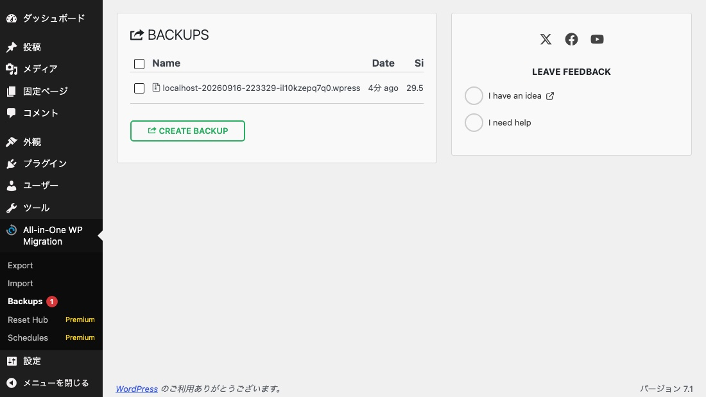
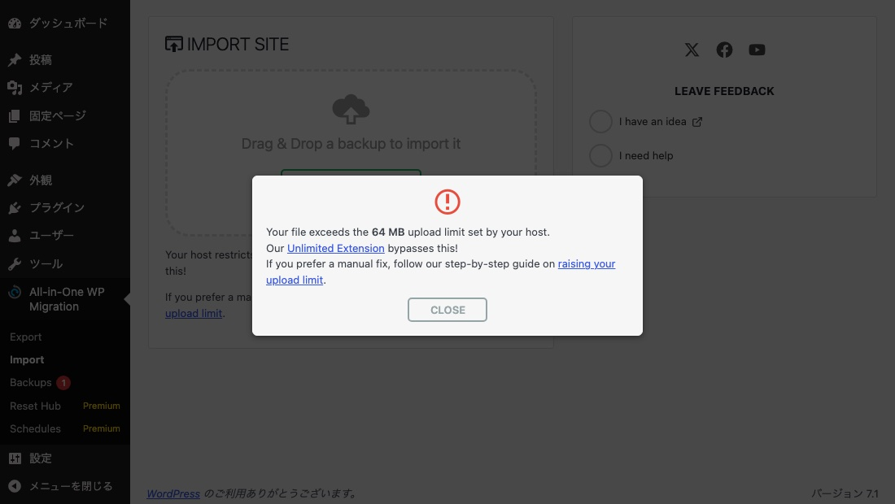

移行でよく使われる All-in-One WP Migration（バージョン 7.111）を入れて、
**書き出したバックアップがどこに置かれ、外から取れるのか**を実測しました。
あわせて、相談の多い「インポートできない」の上限エラーも計測しています。

結果として、**書き出した瞬間にデータベース全体が公開領域に置かれ、
未ログインのまま取得できる状態**になりました。

## 実測 1: 書き出したファイルの置き場所

管理画面の **All-in-One WP Migration > Export > File** で書き出しました。

| | 値 |
|---|---|
| 置き場所 | `wp-content/ai1wm-backups/` |
| ファイル名 | `localhost-20260916-223329-il10kzepq7q0.wpress` |
| サイズ | 31,003,258 バイト（約 30MB） |

ファイル名は **サイト名 + 日付 + 時刻 + ランダムな 12 文字**です。



*Backups の画面。書き出したファイルはここに残り続ける*

同じディレクトリに、プラグインが次のファイルを一緒に置きます。

```
.htaccess  index.html  index.php  robots.txt  web.config
```

`.htaccess` の中身は 3 つの `IfModule` だけでした。

```apache
<IfModule mod_mime.c>
	AddType application/octet-stream .wpress
</IfModule>
<IfModule mod_dir.c>
	DirectoryIndex index.php
</IfModule>
<IfModule mod_autoindex.c>
	Options -Indexes
</IfModule>
```

**アクセスを拒否する記述はありません。**MIME 型の指定、ディレクトリの既定ファイル、
一覧表示の禁止だけです。

## 実測 2: 未ログインで取得できる

ブラウザのセッションを持たない `curl` で、そのまま叩きました。

| | ステータス | Content-Type | 受信サイズ |
|---|---|---|---|
| nginx（8080） | **200** | `application/octet-stream` | **31,003,258** |
| Apache（8082） | **200** | `application/octet-stream` | **31,003,258** |

**どちらも全部返ってきました。**ログインは要求されません。

### 中身はデータベースそのもの

取得したファイルを走査すると、末尾に `database.sql` が入っています。

```
database.sql の位置: 29,948,012 バイト目
CREATE TABLE `SERVMASK_PREFIX_commentmeta` (
INSERT INTO `SERVMASK_PREFIX_comments` VALUES (1,1,...
```

ユーザー表も含まれます（アドレスは伏せています）。

```
INSERT INTO `SERVMASK_PREFIX_users` VALUES
  (1,'admin','$wp$2y$10$IJcZXehw9...','admin','（管理者のメールアドレス）',...)
```

**ログイン名・メールアドレス・パスワードのハッシュが、そのまま平文の SQL として
入っています。**`wp-config.php` が漏れたときと同じ種類の事故です。
→ [設定ファイルは漏れるのか](config-file-exposure.md)

## 実測 3: 見つけられるのか

「ファイル名が分からなければ大丈夫」と考えたくなるところです。実測しました。

| 確認したこと | 結果 |
|---|---|
| ディレクトリの一覧表示 | **200 だが中身は `index.html`**（「Kangaroos cannot jump here」の 1 行） |
| 存在しないファイル | 404 |
| サイトの `robots.txt` | `wp-admin` の 2 行だけ。**バックアップ置き場は書かれていない** |
| プラグインが置く `robots.txt` | `Disallow: /wp-content/ai1wm-backups/`（ただし**このディレクトリの中**にある） |
| 公開ページからのリンク | 0 件 |

一覧は出ません。名前を知らなければ即座には取れません。
ただし**ファイル名は推測不能な秘密ではありません。**

- 日付と時刻は、移行作業をした日が分かれば絞れます
- **プラグインが置く `robots.txt` は、置き場所そのものを名指ししています。**
  クローラに「ここは見るな」と伝える意図ですが、**場所を知らせる記述でもあります**
- バックアップの一覧は管理画面にあるため、管理画面に入れる人には全部見えます

**「取れないから安全」ではなく「名前を知られたら終わり」の状態です。**

## 実測 4: 自動では消えない

プラグインは毎日 1 回 `ai1wm_storage_cleanup` という定期処理を登録します。
何を消しているのかコードを確認しました。

| 定数 | 値 | 対象 |
|---|---|---|
| `AI1WM_MAX_STORAGE_CLEANUP` | 24 時間 | `AI1WM_STORAGE_PATH`（プラグイン内の作業用フォルダ） |
| `AI1WM_MAX_LOG_CLEANUP` | 7 日 | 同上のログ |

掃除の対象は **プラグインの `storage` フォルダ**で、
**`ai1wm-backups` のアーカイブは対象外**です。

つまり**書き出したファイルは、消すまで公開領域に残り続けます。**
「移行のときに 1 回だけ使った」ファイルが、何か月も置かれたままになります。

## 対策の実測

### 1. サーバー設定で拒否する

`.wpress` を拒否する記述を足して、前後を測りました。

```apache
# .htaccess（Apache）
<FilesMatch "\.wpress$">
  Require all denied
</FilesMatch>
```

| | Apache | nginx |
|---|---|---|
| 対策前 | 200 | 200 |
| `.htaccess` に拒否を追加 | **403** | **200（変わらない）** |

**`.htaccess` は nginx では効きません。**nginx 側は設定ファイルに書きます。

```nginx
location ~* /wp-content/ai1wm-backups/ { deny all; }
```

これを入れて再読み込みすると **403** になりました（実測）。

### 2. 使い終わったら消す

自動では消えないので、**移行が終わったらバックアップの一覧から削除します。**
残す必要があるなら、公開領域の外か、別の保管先へ移します。

### 3. 置きっぱなしになっていないか確認する

移行を人に任せた場合、本人が知らないうちに残っていることがあります。

```sh
curl -s -o /dev/null -w '%{http_code}\n' https://example.com/wp-content/ai1wm-backups/
```

**403 か 404 以外が返るなら、置き場所が公開されています。**
中に何が残っているかは管理画面の Backups で確認できます。

## インポートできない（上限エラー）

ここからは相談の多いもう 1 つの症状です。
大きいファイルを取り込もうとすると、この画面が出ます。



*上限を超えたファイルを選んだときのモーダル。アップロードは始まらない*

### 上限は PHP の設定そのもの

判定に使われている値を取り出しました。

| | 値 |
|---|---|
| プラグインが使う `max_file_size` | **67,108,864**（64MB） |
| PHP の `upload_max_filesize` | 64M |
| PHP の `post_max_size` | 64M |
| 画面の表示 | 「Your host restricts uploads to **64 MB**」 |

プラグインは `wp_max_upload_size()` を呼んでいるだけで、
**独自の上限は持っていません。**この関数は
`upload_max_filesize` と `post_max_size` の**小さいほう**を返します。

`php.ini` を両方 128M にして測り直すと、判定値も表示も変わりました。

| | 判定値 | 画面の表示 |
|---|---|---|
| 変更前 | 67,108,864 | 64 MB |
| **128M に変更後** | **134,217,728** | **128 MB** |

**「無料版だから 512MB で制限されている」ではありません。**
サーバーの PHP 設定がそのまま上限です。

### 判定はアップロード前に終わっている

この検査は **ブラウザ側の JavaScript** で行われます。
ファイルを選んだ時点でサイズを比べ、超えていればモーダルを出します。

**サーバーには 1 バイトも送られません。**そのため
「アップロードが途中で止まる」のではなく「選んだ瞬間に断られる」という挙動になります。

対処は PHP の上限を上げることです。**2 つとも上げます。**

```ini
upload_max_filesize = 512M
post_max_size = 512M
```

共用サーバーでは `.user.ini` で指定できることがあります。
`.htaccess` の `php_value` は Apache（mod_php）でだけ有効です。
→ [保存したのに一部だけ消える](max-input-vars-silent-loss.md)

## 画面が英語のままになる

計測中に気づいた点です。日本語の翻訳ファイルは有効（`ja` が active）でしたが、
**画面の主要部は英語で表示されました。**

```
IMPORT SITE / Drag & Drop a backup to import it
Your host restricts uploads to 64 MB
```

「日本語の情報が出てこない」と感じる原因はここにあります。
**検索するときは英語の文言をそのまま使うほうが早い**です。

## まとめ

| 確認すること | 見るところ |
|---|---|
| バックアップが公開されていないか | `wp-content/ai1wm-backups/` のステータス |
| 置きっぱなしになっていないか | 管理画面の Backups |
| 取り込めない | PHP の `upload_max_filesize` と `post_max_size` の**小さいほう** |

**書き出した .wpress はデータベース全体です。**
ファイルを置く場所とアクセス制御を、移行作業とセットで決めます。

## そもそも何を取れば戻せるのか

バックアップの置き場所とは別に、**中身がそろっているか**も確認しておきます。
標準のエクスポート機能だけでは、プラグインも設定も戻りません。
→ [バックアップは何を取れば戻せるのか](backup-and-restore.md)

## 再現手順

```sh
wp plugin install all-in-one-wp-migration --activate

# 管理画面 > All-in-One WP Migration > Export > File で書き出す
ls -l src/wp-content/ai1wm-backups/*.wpress

# 未ログインで取得できるか(Cookie を渡さない)
F=$(basename src/wp-content/ai1wm-backups/*.wpress)
curl -s -o /dev/null -w '%{http_code} %{content_type} %{size_download}\n' \
  "http://localhost:8080/wp-content/ai1wm-backups/$F"
curl -s -o /dev/null -w '%{http_code} %{content_type} %{size_download}\n' \
  "http://localhost:8082/wp-content/ai1wm-backups/$F"

# 中身にデータベースが入っているか
grep -abo 'database.sql' "src/wp-content/ai1wm-backups/$F" | head -1
strings -n 8 "src/wp-content/ai1wm-backups/$F" | grep -m2 'INSERT INTO `SERVMASK_PREFIX_users`'

# 対策(Apache)
printf '\n<FilesMatch "\\.wpress$">\n\tRequire all denied\n</FilesMatch>\n' \
  >> src/wp-content/ai1wm-backups/.htaccess
curl -s -o /dev/null -w 'apache %{http_code}\n' "http://localhost:8082/wp-content/ai1wm-backups/$F"   # 403
curl -s -o /dev/null -w 'nginx  %{http_code}\n' "http://localhost:8080/wp-content/ai1wm-backups/$F"   # 200 のまま

# 対策(nginx): default.conf に location ~* /wp-content/ai1wm-backups/ { deny all; } を足して再起動 → 403

# 上限の判定値(管理画面の Import ページの HTML から)
curl -s -b "<管理者の Cookie>" "http://localhost:8080/wp-admin/admin.php?page=ai1wm_import" \
 | grep -oE '"max_file_size":"[0-9]+"|restricts uploads to <strong>[^<]*'
# → 67108864 / 64 MB。php.ini を 128M にすると 134217728 / 128 MB
```

検証で入れたプラグイン・書き出したアーカイブ・登録された cron は削除済みです。
