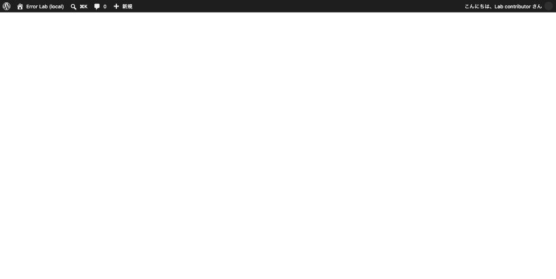

投稿の編集画面を開くと真っ白。あるいは枠だけ出て中身が表示されない。
「エディターの読み込みに失敗しました」と出ることもある。

サイトの表示は正常。他の管理画面も使える。**編集画面だけが開かない。**

ブロックエディターは**大量の JavaScript と REST API に依存**しています。
どちらかが欠けると、画面は白いまま止まります。順に確認します。

## 前提: エディターが読むものの規模

実測した主なファイルのサイズです。

| ファイル | サイズ |
|---|---|
| `/wp-includes/js/dist/block-editor.min.js` | **1,411,106 bytes（約 1.4MB）** |
| `/wp-includes/css/dist/block-editor/style.min.css` | 124,331 bytes |
| `/wp-admin/load-scripts.php`（結合された JS） | 101,132 bytes |
| `/wp-admin/load-styles.php`（結合された CSS） | 142,760 bytes |

**1 ファイルで 1.4MB あります。**これが 1 つでも欠けると、
エディターは初期化に失敗して何も描画しません。

そして重要な点として、**これらはログインしていなくても取得できます。**

つまり **管理画面に入れなくても、外からアセットの生死を確認できます。**

```sh
curl -s -o /dev/null -w '%{http_code}\n' \
  https://example.com/wp-includes/js/dist/block-editor.min.js
```

エディタのアセットを塞いだ状態です。



*管理バーだけが残り、編集領域には何も描画されない*

## 原因 1: セキュリティ設定でアセットが塞がれている

いちばん多い構成ミスです。「WordPress のセキュリティ強化」として
`wp-includes` へのアクセスを拒否する設定が配られていますが、
**範囲が広すぎるとエディターが死にます。**

実測しました。`.htaccess` に `wp-includes` を丸ごと拒否する規則を入れた状態です。

| URL | Apache | nginx |
|---|---|---|
| トップページ | **200** | 200 |
| ログイン画面 | **200** | 200 |
| `/wp-includes/js/dist/block-editor.min.js` | **403** | 200 |
| `/wp-includes/css/dist/block-editor/style.min.css` | **403** | 200 |
| `/wp-admin/load-styles.php` | 200 | 200 |

**サイトも管理画面も正常で、エディターのアセットだけが 403 です。**

`wp-includes` 配下を制限する意図は「PHP ファイルを直接実行されないようにする」
ことですが、**JS と CSS も同じディレクトリにあります。**
制限するなら拡張子で絞ります。

```apache
# 悪い: ディレクトリごと塞ぐ(JS/CSS も死ぬ)
RewriteRule ^wp-includes/ - [F,L]

# 良い: PHP だけ塞ぐ
RewriteRule ^wp-includes/[^/]+\.php$ - [F,L]
RewriteRule ^wp-includes/theme-compat/ - [F,L]
```

nginx 側が無影響なのは `.htaccess` を読まないためです。
**2 台構成で「片方のサーバーでだけエディターが開かない」**場合は、
この非対称性を疑います。

セキュリティプラグインや WAF（ModSecurity）でも同じことが起きます。
`.htaccess` に何も無いのに 403 が返るなら、そちらです。

## 原因 2: REST API に到達できない

ブロックエディターは、記事の読み書きを REST API で行います。
アセットが読めても REST が死んでいると、**枠は出るが中身が入らない**、
あるいは「更新に失敗しました」になります。

```sh
curl -s -o /dev/null -D - https://example.com/wp-json/ | grep -iE '^HTTP|^content-type'
```

`application/json` 以外が返っていたら原因はこちらです。
詳しくは [「返答が正しい JSON レスポンスではありません」](rest-json-update-failed.md)。

**ログイン中でも `curl` で 401 が返るのは正常**（nonce が無いため）なので、
そこで混乱しないようにします。

## 原因 3: JavaScript のエラーで初期化が止まる

アセットも REST も正常なら、**プラグインやテーマが出した JS エラー**で
エディターの初期化が中断しています。

ブロックエディターは 1 つの JS エラーで全体が止まります。
**コンソールの一番上のエラー**を見ます。

| コンソール | 意味 |
|---|---|
| `Refused to execute script … MIME type ('text/html')` | アセットが 404。HTML が返っている |
| `Uncaught SyntaxError: Unexpected token '<'` | 同上（404 ページを JS として読んだ） |
| `$ is not a function` | jQuery の二重読み込み → [プラグインの競合](plugin-conflict-diagnosis.md) |
| `Uncaught TypeError: ... of undefined`（`wp.blocks` など） | 依存の読み込み順。プラグインが独自に JS を差し込んでいる |
| `Mixed Content: … blocked` | https のページから http のアセット → [SSL 化](ssl-mixed-content.md) |

**エラーの出どころのファイル名**が、そのまま原因のプラグインです。

## 原因 4: エディターが無効化されている

「真っ白」ではなく**クラシックエディターの画面が出る**場合は、
壊れているのではなく無効化されています。

- Classic Editor プラグインが有効
- テーマやプラグインが `use_block_editor_for_post` フィルタで無効化している
- 投稿タイプが `show_in_rest` に対応していない（カスタム投稿タイプで多い）

**カスタム投稿タイプだけブロックエディターが使えない**のは、
`register_post_type` に `'show_in_rest' => true` が無いためです。
これは不具合ではなく設定です。

## 切り分けの順番

```sh
# 1. エディターのアセットが生きているか(ログイン不要)
for f in /wp-includes/js/dist/block-editor.min.js \
         /wp-includes/css/dist/block-editor/style.min.css \
         /wp-admin/load-scripts.php /wp-admin/load-styles.php; do
  printf '%s %s\n' "$(curl -s -o /dev/null -w '%{http_code}' "https://example.com$f")" "$f"
done

# 2. REST API が JSON を返すか
curl -s -o /dev/null -D - https://example.com/wp-json/ | grep -i content-type
```

| 結果 | 原因 |
|---|---|
| アセットが 403 | サーバー設定で塞がれている（原因 1） |
| アセットが 404 | ファイルが無い。コアの更新が途中で止まった可能性 |
| REST が JSON でない | REST の遮断・Fatal（原因 2） |
| **全部 200** | JS エラー。コンソールを見る（原因 3） |
| クラシックエディターが出る | 無効化されている（原因 4） |

## 応急処置

**Classic Editor プラグインを入れると、REST API と大量の JS に依存せずに
編集できます。**原因を直すまでの時間を稼げます。

ただし REST API はスマホアプリや外部連携でも使うので、
遮断が原因だった場合は放置すると別の場所で問題が出ます。

## 再現手順

```sh
# .htaccess に(WordPress ブロックより前に)入れる
# RewriteRule ^wp-includes/ - [F,L]

curl -o /dev/null -w 'front %{http_code}\n' http://localhost:8082/
curl -o /dev/null -w 'asset %{http_code}\n' http://localhost:8082/wp-includes/js/dist/block-editor.min.js
# → front 200 / asset 403
```
