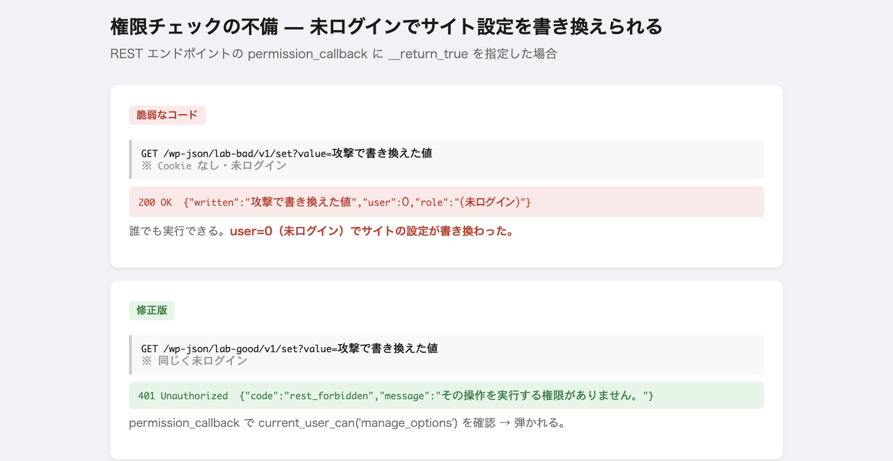

2026 年に報告される WordPress プラグインの脆弱性で、XSS と並んで最も多いのが
**Broken Access Control（権限チェックの不備）** です。

言葉で説明されても実感しにくいので、**脆弱なコードと修正版を並べて、
未ログインの状態から実際にサイトの設定を書き換えられるか**を計測しました。
書き込み先は検証用の専用オプションで、実サイトの設定には触れていません。

## 前提: WordPress は自動では権限を確認しない

これが全ての出発点です。

プラグインが登録するフックやエンドポイントは、**既定では権限も nonce も
確認しません。** 開発者が自分で `current_user_can()` と
`wp_verify_nonce()` を書く必要があります。**書き忘れると、誰でも実行できる
穴になります。**

report される脆弱性の多くは、高度な攻撃技術ではなく
**「このチェックを 1 行書き忘れた」** というものです。

## パターン 1: REST の permission_callback

REST API のエンドポイントには `permission_callback` が必須です。
ここに `__return_true`（常に true を返す）を書くと、**誰でも通ります。**

```php
register_rest_route( 'my/v1', '/set', array(
    'methods'             => 'POST',
    'permission_callback' => '__return_true',   // ← 誰でも通る
    'callback'            => 'my_update_settings',
) );
```

未ログイン・Cookie なしで叩いた実測結果です。



```
GET /wp-json/lab-bad/v1/set?value=攻撃で書き換えた値
→ 200 OK  {"written":"攻撃で書き換えた値","user":0,"role":"(未ログイン)"}
```

**`user: 0`（未ログイン）で書き込みが成功しています。**

`__return_true` は「読み取り専用で公開してよい API」には正しい書き方です
（誰でも記事を読める、など）。**問題は、それを書き込みや管理操作に付けたとき**です。

### 修正

```php
'permission_callback' => function () {
    return current_user_can( 'manage_options' );
},
```

同じリクエストが 401 で弾かれるようになりました。

```
→ 401 Unauthorized  {"code":"rest_forbidden","message":"その操作を実行する権限がありません。"}
```

## パターン 2: admin-ajax の nopriv

WordPress の AJAX には 2 つのフックがあります。

```php
add_action( 'wp_ajax_my_action',        'handler' );  // ログイン済み
add_action( 'wp_ajax_nopriv_my_action', 'handler' );  // ★ 未ログインでも実行
```

**`nopriv` は「未ログインのユーザー」向け**です。ログインフォームや
公開検索のような、誰でも使ってよい機能のためのものです。

ここに管理操作を置くと、未ログインで実行できます。実測です。

```
GET /wp-admin/admin-ajax.php?action=lab_bad_ajax&value=攻撃で書き換えた値
→ {"written":"攻撃で書き換えた値","by":"ajax(nopriv)","role":"(未ログイン)"}
```

**書き込めました。** `admin-ajax.php` というパスに「admin」が入っているため
管理者専用に見えますが、**nopriv に登録した処理は誰でも叩けます。**

### 修正

`nopriv` を登録しない。そのうえで権限と nonce を確認します。

```php
add_action( 'wp_ajax_my_action', function () {
    if ( ! current_user_can( 'manage_options' ) ) {
        wp_send_json_error( '', 403 );
    }
    check_ajax_referer( 'my_action', 'nonce' );
    // 処理
} );
```

未ログインで叩くと、応答は `0`（WordPress が「そのアクションは無い」と返す）
になり、書き込めませんでした。

## パターン 3: is_admin() を権限チェックに使う

**これが最も誤解されているパターンです。** 名前から
「管理者かどうかを確認する関数」に見えますが、違います。

```php
add_action( 'admin_post_my_action', function () {
    if ( ! is_admin() ) {           // ← 権限チェックではない
        wp_die();
    }
    // 管理操作
} );
```

`is_admin()` が返すのは **「このリクエストは wp-admin 向けか」** だけです。
**ユーザーの権限は一切見ていません。**

権限別に `is_admin()` と `current_user_can()` の値を比べました。

| ユーザー | `is_admin()`（admin-post 上） | `current_user_can('manage_options')` |
|---|---|---|
| 未ログイン | — | false |
| **subscriber（購読者）** | **true** | **false** |
| contributor | true | false |
| administrator | true | true |

**購読者でも `is_admin()` は true になります。** つまり上のコードは、
最も権限の低いログインユーザーでも通ります。

実際に購読者アカウントで叩いた結果です。

```
GET /wp-admin/admin-post.php?action=lab_bad_isadmin&value=SUBSCRIBER-4
（購読者の Cookie 付き）
→ {"written":"SUBSCRIBER-4","by":"admin_post(is_admin のみ)","role":"subscriber"}
```

**購読者が管理操作を実行できました。** 購読者は本来 `manage_options` を
持ちません。
ユーザーがどの権限を持っているかの調べ方は → [「権限がありません」から原因の権限を特定する](wp-admin-403-capability.md)

### 修正

`is_admin()` ではなく `current_user_can()` を使う。それだけです。

```php
if ( ! current_user_can( 'manage_options' ) ) {
    wp_die();
}
```

## パターン 4: nonce だけで認可する

これは実測ではなく仕組みの説明です（セッションを厳密に揃える必要があり、
実サイトでの再現とは条件が変わるため）。

nonce（`wp_verify_nonce`）は **「この操作は、その画面を実際に開いた本人が
意図して送ったものか」** を確認するものです。CSRF（罠サイトから勝手に
送信させる攻撃）を防ぎます。

**しかし nonce は「誰が」を制限しません。** nonce を検証する処理は、
そのユーザーの ID とセッションが一致するかを見るだけで、
**権限は見ていません。**

```php
add_action( 'admin_post_my_action', function () {
    check_admin_referer( 'my_action' );   // ← nonce だけ
    update_option( 'important', $_POST['value'] );  // 権限チェックなし
} );
```

このコードは、**購読者が自分の管理画面で取得した正規の nonce** を使えば
通ります。購読者は自分のプロフィール画面などを開けるので、
nonce の取得自体はできてしまうためです。

Patchstack の解説でも繰り返し指摘されている点です。

> nonce による認可には権限昇格の余地がある。nonce が低権限ユーザーに
> 漏れる可能性があるためだ。

**nonce チェックと権限チェックは、両方書く。** どちらか一方ではありません。

```php
if ( ! current_user_can( 'manage_options' ) ) {  // 誰が
    wp_die();
}
check_admin_referer( 'my_action' );               // 意図した操作か
```

## まとめ: 実測した対比

未ログイン、または購読者が、検証用の設定値を書き換えられたか。

| パターン | 書き換え | 誰が |
|---|---|---|
| REST `permission_callback=__return_true` | **できた** | 未ログイン |
| admin-ajax の `nopriv` | **できた** | 未ログイン |
| `is_admin()` のみ | **できた** | 購読者 |
| REST `current_user_can`（修正版） | 弾いた（401） | — |
| AJAX 権限+nonce（修正版） | 弾いた | — |

## 開発者向け: 3 つの原則

| 原則 | 意味 |
|---|---|
| **`is_admin()` は権限チェックではない** | リクエストの宛先を返すだけ。権限は `current_user_can()` |
| **nonce は権限チェックではない** | CSRF を防ぐだけ。権限とは別に確認する |
| **`permission_callback` を省略・`__return_true` にしない** | 書き込み系は必ず権限を返す |

そして最重要なのは、**操作の重さと権限を対応させる**ことです。

```php
current_user_can( 'manage_options' )        // サイト設定
current_user_can( 'edit_posts' )            // 投稿の作成
current_user_can( 'edit_post', $post_id )   // その投稿の編集(所有者確認込み)
```

第 2 引数にオブジェクト ID を渡す形（`edit_post` など）を使うと、
「他人の投稿を編集できてしまう」タイプの穴も防げます。

## 利用者向け: 自分では直せない

この種の脆弱性は**プラグインのコードの問題**なので、利用者側での回避は困難です。

- **更新する。** 報告された脆弱性は修正版が出る。更新が唯一かつ最善の対策
- **使っていないプラグインを消す。** 停止中でもファイルは残り、
  REST や admin-ajax のエンドポイントは**有効化されていなくても
  登録されることがある**
- WAF やセキュリティプラグインで既知の攻撃パターンを弾く（対症療法）

脆弱性情報は Patchstack や WPScan のデータベースで公開されています。
**使っているプラグインが載っていないか**を定期的に確認します。

プラグインの脆弱性とは別に、既定の WordPress が外に見せている情報は
→ [攻撃者から何が見えているか](attack-surface-audit.md)

## 再現手順

```sh
wp plugin activate lab-broken-access

# 未ログインで REST を叩く(permission_callback=__return_true)
curl -s "http://localhost:8080/wp-json/lab-bad/v1/set?value=X"
curl -s "http://localhost:8080/wp-json/lab-bad/v1/get"      # X が保存されている

# 修正版は 401
curl -s -o /dev/null -w '%{http_code}\n' "http://localhost:8080/wp-json/lab-good/v1/set?value=X"

# is_admin() のみ / 購読者の Cookie で
curl -s --cookie "<subscriber cookie>" \
  "http://localhost:8080/wp-admin/admin-post.php?action=lab_bad_isadmin&value=X"
```

## 参考にした情報源

- [Broken Access Control — Patchstack Academy](https://patchstack.com/academy/wordpress/securing-code/broken-access-control/)
- [Learn about Broken Access Control — Patchstack](https://patchstack.com/academy/wordpress/vulnerabilities/broken-access-control/)
- [Exploiting authorization by nonce in WordPress plugins — nowotarski.info](https://nowotarski.info/wordpress-nonce-authorization/)
