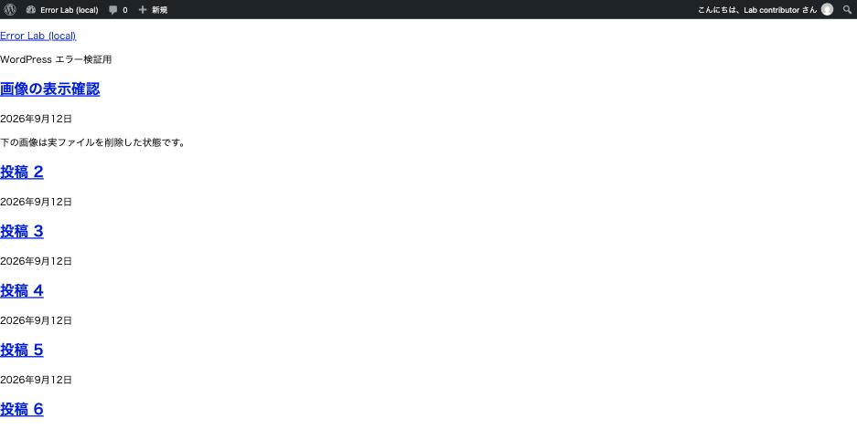

デザインが崩れている。スライダーが動かない。**でもページは普通に開く。**

この症状で最初にやるべきことは、原因の推測ではなく
**「CSS と JS が本当に読み込まれているか」の確認**です。
読み込まれていないのか、読み込まれているが効いていないのかで、
調べる場所が完全に変わります。

## 読み込まれていない場合、ページは 200 のまま

実測しました。テーマの `style.css` を無くした状態です。

| | 結果 |
|---|---|
| ページ本体 | **200**（正常） |
| `<link rel="stylesheet">` のタグ | **出ている** |
| その URL を取得すると | **404** |

つまり **HTML には「この CSS を読め」と書かれているのに、その先が無い**状態です。
ページ本体は 200 なので、死活監視も、ブラウザのアドレスバーも正常に見えます。

スタイルシートが読めていないフロントページです。



*HTML は正常に返っている（リンクも見出しもある）。当たっていないのは CSS だけ*

### 404 の中身が厄介

存在しない CSS の URL を直接叩いた結果です。

```
HTTP/1.1 404 Not Found
Content-Type: text/html
20,732 bytes
<!doctype html><html lang="ja"...
```

**404 なのに 20KB の HTML が返ります。**WordPress の 404 ページです。

`.htaccess`（または nginx の `try_files`）が、存在しないファイルへのリクエストを
`index.php` に流すためです。ブラウザは「CSS を頼んだのに HTML が来た」と判断して
無視します。

ここから 2 つのことが言えます。

- **開発者ツールの Network タブで「20KB 転送された」と見えても、
  中身は CSS ではありません。**サイズだけ見て「読めている」と判断すると外します
- **欠けているアセット 1 つごとに WordPress のフルページ生成が走ります。**
  画像や CSS が 50 個欠けていれば、1 ページ表示で 50 回の WordPress 起動です。
  表示の問題であると同時に、サーバー負荷の問題でもあります

CSS や JS は読めているのに**画像だけが出ない**場合は、原因の切り分け方が変わります。
→ [画像が表示されない](images-not-displaying.md)

サイトは正常で**管理画面だけ**が崩れている場合は、CSS の配信の仕組みが別です。
→ [管理画面だけ表示が崩れる](admin-styles-broken.md)

## 確認方法

ブラウザの開発者ツールで「ネットワーク（Network）」タブを開き、ページを再読み込みして
**ステータスが 404 や 403 の赤い行**を探すのが基本です。
404 でも本文は WordPress の 404 ページ（20KB 前後の HTML）なので、転送量では判断しません。

コマンドで確認するなら、これで十分です。

```sh
# ページ内のスタイルシートとスクリプトの URL を列挙して、ステータスを見る
curl -s https://example.com/ \
 | grep -oE "(href|src)='[^']*\.(css|js)[^']*'" \
 | sed "s/.*='//; s/'$//" | sort -u \
 | while read -r u; do printf '%s %s\n' "$(curl -s -o /dev/null -w '%{http_code}' "$u")" "$u"; done
```

## 読み込まれていない場合の原因

### ファイルが無い

テーマやプラグインの更新が途中で止まった、移行でファイルを持ってこなかった、
`style.css` だけ別名でアップロードした、などです。

**テーマから `style.css` が無くなると、そのテーマは「テーマ」として認識されなくなります。**
実測では `wp theme list` の一覧から消えました（DB 上の設定は残るので、
サイトは壊れた状態で動き続けます）。

### サーバー設定で塞いでいる

「セキュリティ強化」として配られている設定が、範囲が広すぎることがあります。
実測した例です。`.htaccess` に `wp-includes` を丸ごと拒否する規則を入れました。

| URL | Apache | nginx |
|---|---|---|
| トップページ | **200** | 200 |
| ログイン画面 | **200** | 200 |
| `/wp-includes/js/dist/block-editor.min.js` | **403** | 200 |
| `/wp-includes/css/dist/block-editor/style.min.css` | **403** | 200 |

**サイトは正常なのに、特定のディレクトリのアセットだけ 403 になります。**
nginx 側は `.htaccess` を読まないので影響を受けません
（**2 台構成で片方だけ崩れる**という現象の原因になります）。

### URL が間違っている

サイト URL の設定が実際のアクセス先と違うと、アセットの URL も間違ったホストを
指します。**この場合は「404」ではなく「別ホストへのリクエスト」になる**ので、
Network タブでドメイン部分を見ます。

なお `wp-config.php` に `WP_HOME` / `WP_SITEURL` の定数があると、
**データベースを直しても URL は変わりません**（別記事で実測しています）。

## 読み込まれている（200）のに効かない場合

ここからは別の層です。

### ブラウザキャッシュ・サーバーキャッシュ

WordPress はアセットの URL に `?ver=` を付けて、更新時に別 URL として扱わせます。

```
style.css?ver=0.1.0
```

**このバージョンが上がっていないと、ブラウザは古いファイルを使い続けます。**
テーマを編集したのに反映されないときは、まずこの値を見ます。
`style.css?ver=6.8` のように WordPress 本体のバージョンが入っていると、
テーマを更新しても値が変わらないため、キャッシュが残り続けます。

対処は、テーマ側で**ファイルの更新時刻をバージョンに使う**ことです。

```php
wp_enqueue_style(
	'my-theme',
	get_stylesheet_uri(),
	array(),
	(string) filemtime( get_stylesheet_directory() . '/style.css' )
);
```

キャッシュプラグインや CDN が絡む場合は、そちらのキャッシュも消します。
**「自分のブラウザでは直っているが他の人には古いままに見える」**なら、
サーバー側かCDN 側のキャッシュです。
スマホだけが崩れる場合は → [スマホだけレイアウトが崩れる](mobile-layout-broken.md)

### 読み込み順（依存関係）

CSS は後に読まれたものが勝ちます。JS は依存関係が崩れると
**「まだ読み込まれていないライブラリを使う」**ことになります。

典型例は jQuery です。実測でも確認しましたが、
**`wp_enqueue_script` を通さず生の `<script>` タグで読み込むと、
WordPress からはその読み込みが見えません。**

```php
// 悪い例: WordPress の依存解決の外に出る
add_action( 'wp_footer', function () {
	echo '<script src="/path/to/jquery.min.js"></script>';
} );
```

あとから読まれた jQuery が `window.jQuery` を上書きするため、
**先に初期化を終えていたプラグインの状態が消えます。**
症状は「`$ is not a function`」「スライダーやモーダルが動かない」です。

正しくはこうします。

```php
wp_enqueue_script( 'my-script', $url, array( 'jquery' ), $ver, true );
```

依存に `jquery` を書けば、WordPress が順序を保証し、
**同じハンドルを 2 回読み込むこともしません。**

### minify / 結合プラグイン

キャッシュ系プラグインの「JS を結合・圧縮する」機能は、
**依存関係の順序を壊すことがあります。**

切り分けは簡単です。**その機能だけをオフにして再確認します。**
プラグイン全体を止める必要はありません。直るなら結合が原因で、
除外設定（特定のファイルを結合対象から外す）で運用できます。

## JavaScript はコンソールの 1 行目を見る

「JS が動かない」ときは、ブラウザのコンソールを開いて**一番上のエラー**を見ます。
下のエラーは、上のエラーの結果として出ているものが多いためです。

| コンソールのメッセージ | 意味 |
|---|---|
| `$ is not a function` / `jQuery is not defined` | jQuery が読まれていない、または上書きされた |
| `Uncaught SyntaxError` | ファイルが壊れている。**HTML が返っていることも**（404 の 20KB） |
| `Failed to load resource: 404` | ファイルが無い。アセットの確認へ |
| `Failed to load resource: 403` | サーバー設定で塞がれている |
| `Mixed Content: … was blocked` | https のページから http のリソースを読んでいる |
| `Refused to execute script … MIME type ('text/html')` | **404 の HTML をスクリプトとして読もうとしている** |

最後のものが出ていたら、**ファイルが無いのが確定**です。
MIME タイプが `text/html` になっているのは、WordPress の 404 ページが
返ってきている証拠です。

## 切り分けの順番

1. **アセットのステータスを数える**（404 / 403 があるか）
2. 404 → ファイルの有無、URL の設定
3. 403 → サーバー設定（`.htaccess`、セキュリティプラグイン、WAF）
4. **全部 200 なら**読み込みは成功している。キャッシュ・順序・結合を見る
5. JS はコンソールの 1 行目を読む

## 再現手順

```sh
# 1. ファイルを無くす
mv src/wp-content/themes/<theme>/style.css{,.off}
bin/diagnose.sh                                   # 404=1 が出る
curl -s -o /dev/null -D - "http://localhost:8080/wp-content/themes/<theme>/style.css"
# → 404 / Content-Type: text/html / 20KB
mv src/wp-content/themes/<theme>/style.css{.off,}

# 2. サーバー設定で塞ぐ(WordPress ブロックより前に置く)
# RewriteRule ^wp-includes/ - [F,L]
curl -o /dev/null -w '%{http_code}\n' http://localhost:8082/wp-includes/js/dist/block-editor.min.js  # 403
curl -o /dev/null -w '%{http_code}\n' http://localhost:8080/wp-includes/js/dist/block-editor.min.js  # 200
```
