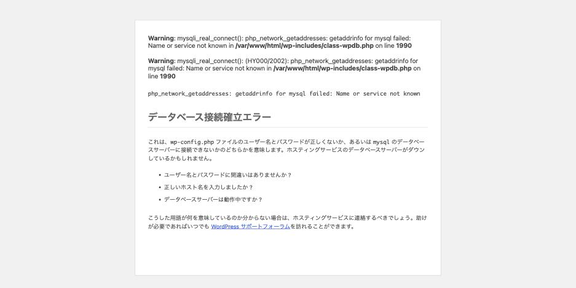

サイトを開いたら、この画面だけが出ている。

> データベース接続確立エラー

原因として考えられるのは、認証情報の誤り・ホスト名の誤り・DB 名の誤り・
MySQL の停止・接続数の枯渇。**しかし画面を見ても、どれなのかは分かりません。**
5 通りすべてを再現して計測した結果をまとめます。

## 結論から: 画面はバイト単位で同一

5 つの原因を順に作り、返ってきた HTML のハッシュを取りました。

| 原因 | HTTP | 画面の md5 |
|---|---|---|
| MySQL 停止 | 500 | `dc1c3f9f…` |
| パスワード誤り | 500 | `dc1c3f9f…` |
| ホスト名誤り | 500 | `dc1c3f9f…` |
| DB 名誤り | 500 | `dc1c3f9f…` |
| 接続数枯渇 | 500 / 200 が混在 | `dc1c3f9f…` |

**全部同じです。**画面から情報を取ろうとするのは無駄なので、最初から
ログと WP-CLI を見ます。


## 切り分け 1: debug.log の MySQL エラー番号を見る

`WP_DEBUG_LOG` を有効にしていれば、`wp-content/debug.log` に PHP の警告が
残ります（有効にする設定と、ログの場所は [debug.log の場所と見方](where-are-the-logs.md)）。**ここだけが原因を区別できます。**

| 原因 | debug.log |
|---|---|
| パスワード誤り | `(HY000/1045)` `Access denied for user 'wp'@'…' (using password: YES)` |
| ホスト名誤り | `(HY000/2002)` `getaddrinfo for <host> failed: Name or service not known` |
| MySQL 停止 | `(HY000/2002)` `getaddrinfo for <host> failed`（ホスト名誤りと同じ） |
| 接続数枯渇 | `(HY000/1040)` `Too many connections` |
| DB 名誤り | **何も出ない** |

読み方はこうなります。

- **1045** → 認証。ユーザー名かパスワードが違う。`wp-config.php` を見る
- **2002** → 到達できない。ホスト名の誤りか、MySQL が動いていないか
- **1040** → 接続数の枯渇。設定ミスではなく負荷の問題
- **ログが空** → DB 名の誤り（後述）

注意点は **2002 が 2 原因で共有されている**ことです。
「ホスト名が間違っている」のか「MySQL が落ちている」のかは、ここでは決まりません。
コンテナやサーバーが停止していると DNS 解決そのものが失敗するため、
名前の誤りと同じメッセージになります。切り分けには `mysqladmin ping` などで
ホストの生死を別に確認します。

## 切り分け 2: DB 名の誤りは WP-CLI でしか分からない

DB 名を間違えた場合、**画面は同じ、debug.log は空**です。手がかりがゼロになります。

唯一原因を教えてくれるのが WP-CLI です。WordPress をブートする任意のコマンドで
いいので、`wp option get` あたりを叩きます。

```
$ wp option get blogname
Error: `Access denied for user 'wp'@'%' to database 'wp_typo'`
データベースを選択できません
データベースサーバーに接続することはできましたが (これはユーザー名とパスワードには
問題がないということです)、`wp_typo` データベースは選択できませんでした。
```

**「接続はできたが選択できなかった」**という、画面には一切出ない情報が出ます。
WordPress 自体はこの区別を持っているのに、ブラウザ向けの出力では捨てています。

Web が完全に死んでいても WP-CLI は動くので、DB 系の障害ではまずこれを叩くのが
最短です。

## 切り分け 3: 接続数枯渇だけは「時々成功する」

これが他の 4 原因と決定的に違う点です。`max_connections = 2` にして計測しました。

**同時 12 リクエスト**

```
500 500 500 500 500 500 500 500 500 500 200 200
```

10 件が 500、2 件が 200。

**逐次 8 リクエスト**

```
200 200 200 200 200 200 200 200
```

**全部成功します。**

つまり、設定ミス系（1045 / 2002 / DB 名）は**必ず失敗する**のに対し、
接続数枯渇は**アクセスが重なったときだけ失敗する**。

- 「昼間だけ落ちる」「時々落ちる」「リロードしたら直った」→ 接続数枯渇を疑う
- 手元で `curl` を 1 回叩いて再現しないなら、同時アクセスを作って試す

逆に言うと、**単発の確認で再現しない障害を「直った」と判断してはいけません。**

## display_errors が有効だとステータスが 200 になる

もう 1 つ、監視に関わる落とし穴があります。同じ「MySQL 停止」の状態で、
`WP_DEBUG_DISPLAY` の値だけを変えて計測しました。

| `display_errors` | HTTP | `<title>` | 画面 |
|---|---|---|---|
| Off | **500** | `データベースエラー` | 見出し 1 行だけ |
| On | **200** | `WordPress › エラー` | PHP の Warning + 確認項目つきの詳しい案内 |



原因はヘッダの送出タイミングです。`display_errors` が有効だと
`mysqli_real_connect()` の Warning が**先に出力される**ため、その時点で
`200 OK` のヘッダが確定します。あとから WordPress のエラーハンドラが
500 を設定しようとしても、もう書き換えられません。

結果、**サイトが完全に死んでいるのに監視は 200 を受け取ります。**
これは [REST API の Fatal error が 200 で返る](http-200-when-site-is-down.md)のと同じ機構です。

本番で `display_errors` を切るべき理由は、情報漏洩の防止だけではありません。
**障害を 500 として正しく通知させるため**でもあります。

## 切り分けの順番

1. **WP-CLI を叩く**（`wp option get blogname`）。DB 名の誤りならここで確定する
2. **`debug.log` のエラー番号を見る** — 1045 なら認証、2002 なら到達性、1040 なら接続数
3. **2002 だったら、MySQL の生死を別に確認する**（名前の誤りと区別できないため）
4. **必ず失敗するか、時々失敗するかを確認する** — 時々なら接続数枯渇
5. 監視が 200 を返していても信用しない。`display_errors` が有効なら死んでいても 200

## 再現手順

```sh
# A. MySQL 停止
docker compose stop mysql
docker compose start mysql

# B. パスワード誤り(php 側だけ変えて再作成する)
# .env: MYSQL_PASSWORD=wrongpass
docker compose up -d --no-deps php apache

# C. ホスト名誤り
# compose.yml: DB_HOST: mysql-typo
docker compose up -d --no-deps php apache

# D. DB 名誤り
# .env: MYSQL_DATABASE=wp_typo
docker compose up -d --no-deps php apache
wp option get blogname          # ここだけが原因を教えてくれる

# E. 接続数枯渇
# docker/mysql/my.cnf: max_connections = 2
docker compose restart mysql
for i in $(seq 12); do curl -s -o /dev/null -w '%{http_code} ' "http://localhost:8080/?x=$i" & done; wait
```

`--no-deps` を付けないと `docker compose up` が MySQL まで起動してしまい、
止めたはずの状態が復活します。計測がずれるので必須です。
