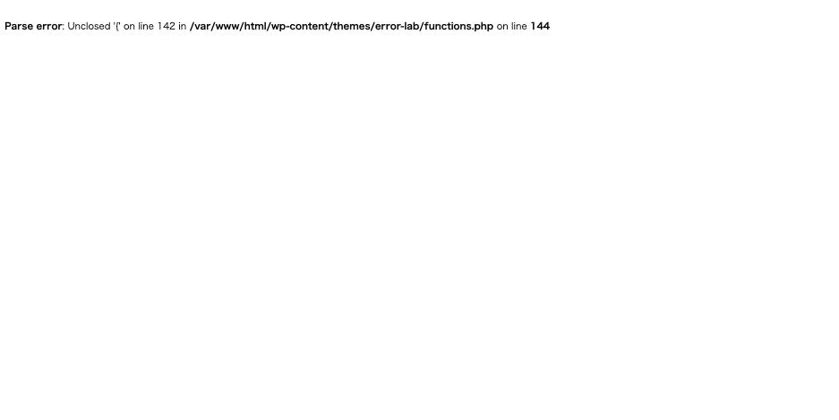

`functions.php` を編集したらサイトが落ちた。管理画面にも入れない。

壊し方によって症状がまったく違います。**片方は一目で分かり、もう片方は
「サイトは普通に表示されている」ように見えます。**2 パターンを再現して
計測しました。

## パターン 1: 構文エラー — 全部 500 になる

閉じ括弧を 1 つ落とした状態です。

| | HTTP | 画面 |
|---|---|---|
| サイト表示 | **500** | 「このサイトで重大なエラーが発生しました。」 |
| `/wp-admin/` | **500** | 同上 |
| `/wp-login.php` | **500** | 同上 |

**ログイン画面すら 500 になります。**ブラウザからの入口が全部閉じます。

`display_errors` が有効な環境では、画面にそのまま出ます。



*`Parse error: Unclosed '{' on line 142` — ファイル名と行番号まで出る。本番では
これが訪問者に見えるので `display_errors` は切る*

`debug.log` には場所が正確に出ます。

```
Parse error: Unclosed '{' on line 142 in
/var/www/html/wp-content/themes/error-lab/functions.php on line 144
```

「142 行目の `{` が閉じていない」と行番号まで名指しされるので、ファイルを
触れるなら直すのは簡単です。問題は**触る手段があるかどうか**です。

### リカバリーモードのメールは来ないことがある

WordPress 5.2 以降にはリカバリーモードがあり、復帰用リンクが管理者宛に
メールで届く仕組みになっています。しかし今回、**メールは 1 通も届きませんでした**
（検証環境の受信箱で 0 通）。

このメールには送信のレート制限があり、既定では **1 日 1 通**です。
同じサイトで前日以降にリカバリーモードのメールが送られていると、
次の障害では届きません。**メールを待つ復旧手順は当てにできません。**

## 復旧: WP-CLI も落ちるが `--skip-themes` で抜けられる

まず知っておくべきなのは、**WP-CLI も同じ構文エラーで死ぬ**ことです。

```
$ wp theme activate twentytwentyfive
Parse error: Unclosed '{' on line 142 in .../functions.php on line 144
Error: このサイトで重大なエラーが発生しました。
```

WP-CLI は WordPress を読み込んでから動くので、壊れたテーマの
`functions.php` もそのまま読みます。「Web が死んでも WP-CLI が使える」は
**この場合は成り立ちません。**

抜け道は `--skip-themes` です。テーマを読み込まずに WordPress を起動します。

```
$ wp --skip-themes theme activate twentytwentyfive
Success: Switched to 'Twenty Twenty-Five' theme.
```

切り替え後の実測値:

| | HTTP |
|---|---|
| サイト表示 | **200** |
| `/wp-admin/` | **302**（ログインへ）|

**これが最短の復旧手順です。**プラグイン側が原因なら `--skip-plugins` が同じ役割を
果たします。

## パターン 2: 末尾の空白 — 200 のまま壊れる

`?>` のあとに空白や改行が 1 バイトでも残っていると起きるものです。
こちらのほうが厄介です。

| | 正常 | 壊れている |
|---|---|---|
| サイト表示 | 200 | **200** |
| 正規化リダイレクト（`/?p=1`） | **301** | **200**（リダイレクトしない） |
| `/wp-login.php` の `Set-Cookie` | **1 個** | **0 個** |

サイトは普通に表示されます。**壊れるのはヘッダを送る処理だけ**です。

- リダイレクトが効かなくなる（`wp_redirect()` が失敗する）
- **Cookie が発行できないのでログインできない**

`Set-Cookie` が 0 個になるのが決定的です。WordPress はログイン前にテスト用
Cookie を置くので、これが失敗すると「Cookie が原因でログインできません」
という趣旨のエラーになります。**ユーザーからは「ログインできない」としか
見えません。**
→ [ログインできない時の症状別の見分け方](login-impossible.md)

原因は `debug.log` に正確に出ます。

```
Warning: Cannot modify header information - headers already sent by
(output started at /var/www/html/wp-content/themes/error-lab/functions.php:142)
in /var/www/html/wp-includes/pluggable.php on line ...
```

**`output started at` の後ろが原因のファイルと行番号です。**
`pluggable.php` の行番号ではなく、こちらを見ます。

### display_errors を切ると手がかりが消える

本番と同じく `display_errors` を切って計測すると、こうなります。

| | 値 |
|---|---|
| HTTP | 200 |
| 画面の警告 | **0 件** |
| リダイレクト | 効かない |
| `Set-Cookie` | **0 個** |

**画面には何も出ません。**症状（ログインできない、リダイレクトされない）だけが
残ります。`WP_DEBUG_LOG` を有効にしていなければ、手がかりはゼロです。

対策は単純で、**`functions.php` の末尾に `?>` を書かない**ことです。
PHP は閉じタグを省略できます。省略しておけば、後ろに空白が入る余地がありません。

## 補足: テーマエディタが「権限がありません」と言うとき

管理画面の `外観 > テーマファイルエディター` で直そうとして、管理者なのに
こう言われることがあります。

> このサイトのテンプレートを編集する権限がありません。

ロールを疑う前に `wp-config.php` を見てください。

```php
define( 'DISALLOW_FILE_EDIT', true );
```

この定数が有効だと、`edit_themes` 権限を持つ管理者でもエディタは使えません。
**メッセージは「権限がありません」ですが、原因は権限ではなく設定です。**
実測でも、管理者ユーザー（`edit_themes` あり）で編集 API を呼んで
`unauthorized` が返りました。

セキュリティ上は正しい設定なので、外すのではなく FTP / SSH / ファイルマネージャで
直します。

## WP-CLI が無い環境では

テーマのフォルダを FTP でリネームすると、フロントは真っ白のままですが
管理画面に入れるようになり、WordPress が既定テーマへ切り替えます（実測）。
phpMyAdmin があれば `template` / `stylesheet` の 2 行更新が最速です。
手順は [WP-CLI が無い環境での復旧](recovery-without-wp-cli.md)。

## 切り分けの順番

1. **サイトが 500 か 200 かを見る**
   - 500 → 構文エラー。`debug.log` に行番号が出る
   - サイトは 200 で管理画面だけ落ちる → [管理画面だけ真っ白](admin-only-white-screen.md)
   - 200 なのに「ログインできない」「リダイレクトされない」→ `headers already sent`
2. `debug.log` を見る。構文エラーなら `Parse error`、空白なら
   `Cannot modify header information ... output started at`
3. **復旧は `wp --skip-themes theme activate <別テーマ>`**
   - WP-CLI 単体では落ちる。`--skip-themes` が必要
4. リカバリーモードのメールは待たない（1 日 1 通の制限がある）

## 再現手順

```sh
cp src/wp-content/themes/<theme>/functions.php /tmp/functions.php.bak

# パターン 1: 構文エラー
printf '\nfunction nl_broken() {\n\treturn true;\n' >> src/wp-content/themes/<theme>/functions.php
curl -o /dev/null -w '%{http_code}\n' http://localhost:8080/            # 500
curl -o /dev/null -w '%{http_code}\n' http://localhost:8080/wp-login.php # 500
grep "Parse error" src/wp-content/debug.log

# 復旧
wp --skip-themes theme activate twentytwentyfive

# パターン 2: 末尾の空白
printf '?>\n \n' >> src/wp-content/themes/<theme>/functions.php
curl -s -o /dev/null -D - "http://localhost:8080/?p=1" | grep -i "^HTTP"   # 200(301 が消える)
curl -s -o /dev/null -D - "http://localhost:8080/wp-login.php" | grep -ci "^set-cookie"  # 0

cp /tmp/functions.php.bak src/wp-content/themes/<theme>/functions.php
wp theme activate <theme>
```
