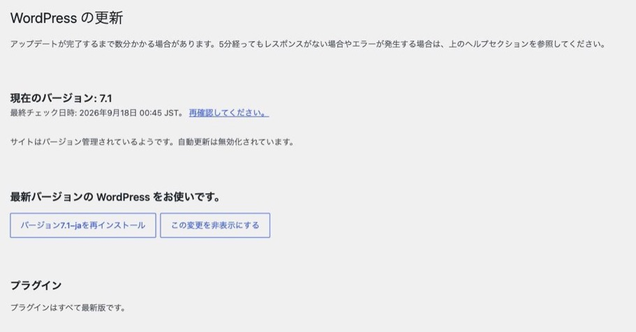
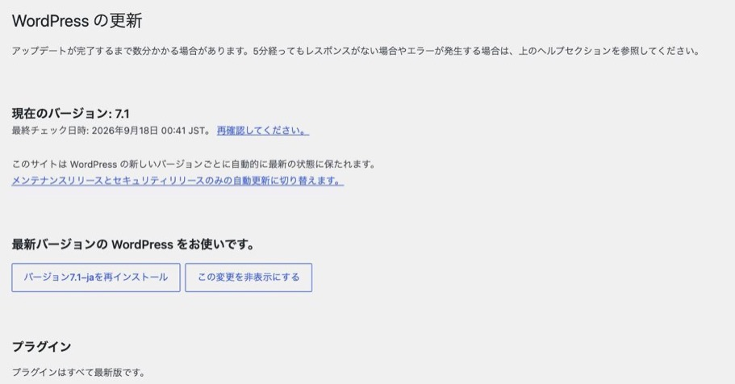

WordPress を git で管理してデプロイしている現場で、
**自動更新が一度も走っていない**ことがあります。

`wp-config.php` に自動更新を止める定数は入っていない。それでも更新されない。
原因は、**リポジトリの `.git` ディレクトリそのもの**でした。実測した結果を示します。

## 実測: `.git` を置くだけで判定が変わる

WordPress には、サイトがバージョン管理下にあるかを見る判定
（`WP_Automatic_Updater::is_vcs_checkout()`）があります。
自動更新を止める定数をすべて外した状態で、`.git` の有無だけを変えて測りました。

| 判定 | `.git` なし | `.git` あり |
|---|---|---|
| `is_vcs_checkout()` | false | **true** |
| 本体のマイナー更新（7.1 → 7.1.1） | true | **false** |
| プラグイン（`auto_update_plugins` に登録済み） | true | **false** |
| テーマ | false | false |
| 翻訳 | false | false |

**本体もプラグインも、更新されなくなりました。**

止まるのは「自動更新を有効にしていないもの」ではありません。
`auto_update_plugins` にファイル名を入れて**有効にしたはずのプラグインまで false になります。**
既定でどこまでが自動になるのかは
→ [自動更新は既定でほとんど動かない](auto-update-not-working.md)

## 管理画面の文言も変わる

`.git` があると、更新画面（ツール > 更新）の文章が差し替わります。



*`.git` を置いた状態*



*`.git` を消した状態。ほかの設定は同じ*

> サイトはバージョン管理されているようです。自動更新は無効化されています。

この 1 行が出ていれば、原因はバージョン管理です。
**画面には出ているので、更新画面を見る習慣があれば気づけます。**
逆に言えば、見ていなければ気づく機会はここしかありません。

## 落とし穴: プラグインの「自動更新」列は残る

止まっているのに、**プラグイン一覧の「自動更新」の列は消えません。**

| 判定 | `.git` なし | `.git` あり |
|---|---|---|
| `wp_is_auto_update_enabled_for_type('plugin')`（列の表示に使われる） | true | **true のまま** |

`AUTOMATIC_UPDATER_DISABLED` で止めた場合は列そのものが消えるため、
画面を見れば止まっていると分かります。
**`.git` の場合は列が残り、「自動更新を有効化」も押せて、有効になったように見えます。**
それでも更新は走りません。

「設定したはずなのに上がっていない」という食い違いは、ここで起きます。

## 定数による無効化とは別の経路

`wp-config.php` の定数を確認しても、この状態は見つかりません。

| 判定 | `.git` なし | `.git` あり |
|---|---|---|
| `is_disabled()`（定数による無効化） | false | **false のまま** |

`is_disabled()` は `AUTOMATIC_UPDATER_DISABLED` などの定数を見る判定です。
バージョン管理による停止は**これとは別の経路**なので、
定数を消してもバージョン管理による停止は解除されません。

## `.git` はどこにあると検出されるか

実測では、**WordPress 本体より 1 階層上に置いた `.git` でも検出されました。**

| `.git` の場所 | ABSPATH | 検出 |
|---|---|---|
| `/var/www/.git`（1 階層上） | `/var/www/html/` | **される** |

WordPress は ABSPATH から上のディレクトリへたどって探すため、
**リポジトリのルートが WordPress の外にあっても止まります。**
「`.git` は公開ディレクトリの外に置いてあるから関係ない」は成り立ちません。

`.svn` / `.hg` / `.bzr` も同じ判定に含まれます（実測したのは `.git` です）。

なお `.git` が公開ディレクトリの中にあると、設定ファイルや履歴が外から読める場合があります。
→ [wp-config.php は漏れるのか](config-file-exposure.md)

## 運用で決めておくこと

git で管理すること自体は問題ではありません。
**更新の担当が WordPress からデプロイの仕組みに移る**、というだけです。
そのつもりが無いまま移っている状態が危険です。

- **更新をリポジトリ側で行う。**本体・プラグインを更新してコミットし、デプロイする。
  自動更新に任せると、サーバー上のファイルとリポジトリが食い違います
- **更新の頻度と担当を決める。**自動で上がらない以上、人が動かなければ止まったままです。
  誰がいつ更新したかは WordPress に残りません
  → [誰が何を変えたか記録しない](no-audit-log.md)
- **更新画面の 1 行を確認する。**「バージョン管理されているようです」が出ていれば止まっています
- **戻せる状態を用意してから更新する。**更新で壊れたときに戻す手順は先に決めておきます
  → [バックアップは何を取れば戻せるのか](backup-and-restore.md)
  → [プラグイン更新後に真っ白・不具合が出た時の対処法](plugin-conflict-diagnosis.md)

判定を上書きするフィルタ（`automatic_updates_is_vcs_checkout`）もありますが、
自動更新でファイルが書き換わるとリポジトリとの差分になります。
**この記事では実測していません。**

## 再現手順

```sh
# 1. 自動更新を止める定数をすべて外した状態にしてから測る

# .git が無いときの判定
wp eval '
require_once ABSPATH . "wp-admin/includes/class-wp-upgrader.php";
$u = new WP_Automatic_Updater();
printf("is_vcs_checkout: %s\n", var_export($u->is_vcs_checkout(ABSPATH), true));
printf("is_disabled:     %s\n", var_export($u->is_disabled(), true));'

# 2. WordPress の 1 階層上に .git を作る
mkdir -p /var/www/.git

# 3. 同じ判定をもう一度測る（is_vcs_checkout だけが true に変わる）

# 本体・プラグインの判定
wp eval '
require_once ABSPATH . "wp-admin/includes/class-wp-upgrader.php";
$u = new WP_Automatic_Updater();
$core = (object) ["response" => "upgrade", "current" => "7.1.1", "new_files" => false,
  "locale" => "ja", "packages" => (object) ["full" => "https://example.com/wp.zip"],
  "php_version" => "7.2.24", "mysql_version" => "5.5.5", "download" => "https://example.com/wp.zip"];
printf("本体マイナー: %s\n", var_export($u->should_update("core", $core, ABSPATH), true));

update_site_option("auto_update_plugins", ["hello.php"]);
$plugin = (object) ["id" => "w.org/plugins/hello-dolly", "slug" => "hello-dolly",
  "plugin" => "hello.php", "new_version" => "1.7.3"];
printf("プラグイン:   %s\n", var_export($u->should_update("plugin", $plugin, ABSPATH), true));
printf("列の表示:     %s\n", var_export(wp_is_auto_update_enabled_for_type("plugin"), true));
delete_site_option("auto_update_plugins");'

# 4. 片付ける
rmdir /var/www/.git
```

`wp_is_auto_update_enabled_for_type()` は `core` を扱いません（常に false が返ります）。
本体の判定は `should_update()` で測ります。
