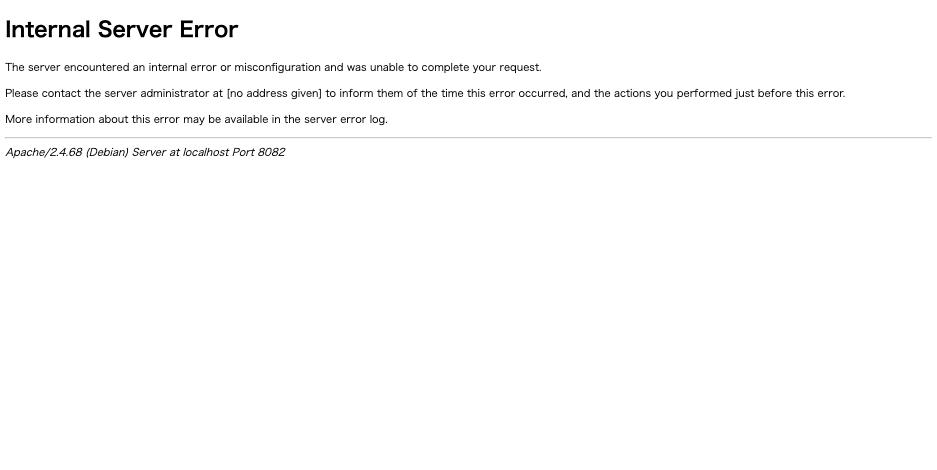
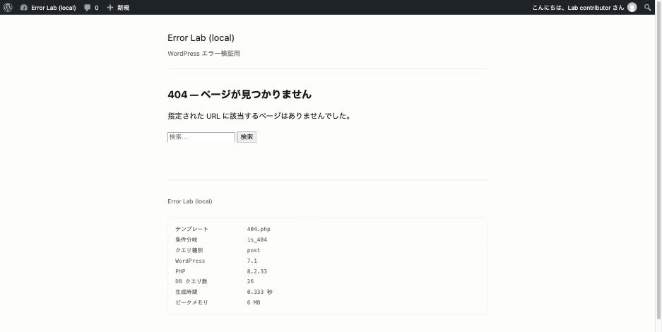

`.htaccess` を編集した直後からサイトが 500 になった。あるいはもっと厄介な形で、
**トップページは普通に表示されるのに、個別記事だけ 500 になる。**

原因の切り分け方を、実測値付きでまとめます。同じ `.htaccess` を Apache と nginx の
両方から同時に見られる環境で計測しました。

## まず: nginx では何も起きない

`.htaccess` を読むのは Apache だけです。同じ壊れたファイルを置いて、
2 つのゲートウェイから同じパスを叩いた結果がこれです。

| 壊し方 | Apache | nginx |
|---|---|---|
| ディレクティブのタイプミス | **500** | 200（正常） |
| `RewriteBase` の誤り | **500** | 404（通常の WordPress 404） |





レンタルサーバーはほぼ Apache なので実務では Apache 側の話になりますが、
**切り分けの初手は「Web サーバーを変えても出るか」**です。ここで割れたら、
原因は確実に `.htaccess` かリライト設定にあります。

## ログの 1 行で原因が確定する

画面に出るのはどちらも同じ Apache の既定 500 ページで、区別がつきません。
違いが出るのは `error.log` です。

### A. ディレクティブのタイプミス

`RewriteRule` を `RewritRule` と書いた場合。

```
[core:alert] /var/www/html/.htaccess: Invalid command 'RewritRule',
perhaps misspelled or defined by a module not included in the server configuration
```

綴りが名指しされるので一発です。ただし後半の
「defined by a module not included」に注意してください。
**綴りが正しくてもモジュール未ロードなら同じメッセージが出ます。**
`mod_headers` を入れずに `Header set` と書いた場合などが該当します。

### B. RewriteBase の誤り（無限リライトループ）

```
AH00124: Request exceeded the limit of 10 internal redirects due to probable
configuration error. Use 'LimitInternalRecursion' to increase the limit if necessary.
```

こちらはファイル名も行番号も出ません。**構文としては正しいので、
タイプミスを探しても見つかりません。**`AH00124` が出ていたら
リライトのループを疑います。

## 「トップだけ見える」の正体

B の状態で URL ごとにステータスを取った実測値です。

| URL | Apache | 理由 |
|---|---|---|
| `/` | **200** | `REQUEST_FILENAME` がディレクトリなので `!-d` 条件で止まり、書き換えが走らない |
| `/sample-post/` | **500** | 実体が無いので書き換えが走り、ループする |
| `/wp-login.php` | 200 | 実ファイルなので `!-f` 条件で止まる |
| `/index.php` | 301 | 正規化リダイレクト |
| `/wp-admin/` | 302 | ログイン画面へのリダイレクト |

トップページ、ログイン画面、管理画面は**すべて生きています。**
壊れているのはパーマリンク経路だけです。

この状態を「サイトは動いている」と誤診しやすいのが厄介なところです。
管理画面に入れるので設定を疑い始めてしまいますが、原因は `.htaccess` の 1 行です。

記事だけが 500 ではなく **404** になる場合は、ループではなく `.htaccess` が効いていません。
→ [投稿だけ 404 になる](posts-404-permalink.md)

## なぜループするのか

再現したのは、サイト移設でよくある形です。

```apache
RewriteBase /blog/
RewriteRule ^index\.php$ - [L]
RewriteCond %{REQUEST_FILENAME} !-f
RewriteCond %{REQUEST_FILENAME} !-d
RewriteRule . index.php [L]
```

最後の行の置換先が **相対パス**（`index.php`）になっている点が肝です。
相対パスの場合、`RewriteBase` の値が前置されます。

1. `/sample-post/` は実ファイルでもディレクトリでもない → 条件を通過
2. `RewriteBase /blog/` + `index.php` → `/blog/index.php` に書き換え
3. `/blog/index.php` も存在しない → `.htaccess` が再評価される
4. 2 に戻る

10 回で Apache が打ち切り、500 になります。

WordPress が自動生成するのは `RewriteRule . /index.php [L]`、
つまり**先頭にスラッシュのある絶対パス**です。この場合 `RewriteBase` は
無視されるのでループしません。**手で相対パスに直した瞬間に壊れます。**

サイトを `/blog/` からルートに移したときに `RewriteBase` だけ直し忘れる、
あるいは移設ツールが書き換えに失敗する、というのが典型的な経路です。

## おまけ: php_value は Apache だけ効く

共有レンタルサーバーの FAQ でよく案内される、`.htaccess` への `php_value`
書き込み。これも Apache 限定です。`php_value memory_limit 32M` を追記して、
両方から同じプローブを叩きました。

| | SAPI | 追記前 | 追記後 |
|---|---|---|---|
| Apache | `apache2handler` | 256M | **32M** |
| nginx + php-fpm | `fpm-fcgi` | 256M | **256M**（無視） |

mod_php は Apache のプロセス内で PHP を動かすので `.htaccess` を解釈できます。
php-fpm は別プロセスなので、`.htaccess` の内容は届きません。
**「php_value を書いたのに設定が変わらない」の原因はこれです。**
php-fpm 環境では `.user.ini` か `php.ini` を使います。

## 500 と 502 と 504 を区別する

`.htaccess` 起因は必ず 500 です。**502 と 504 は別の原因**なので、
ステータスコードを見るだけで切り分けの方向が決まります。実測値です。

| 状態 | Apache | nginx | nginx のログ |
|---|---|---|---|
| `.htaccess` が壊れている | **500** | 影響なし | Apache 側に出る |
| PHP のプロセスを止めた | 200 | **504** | `upstream timed out (110) while connecting to upstream` |
| PHP のコンテナを作り直して IP が変わった | 200 | **502** | `connect() failed (111: Connection refused) while connecting to upstream` |

- **500** → PHP かその手前（`.htaccess`）の問題。Apache のログを見る
- **504** → 接続しようとして返事が無い。宛先が沈黙している（プロセス停止・ハング）
- **502** → 接続が**拒否**された。宛先はいるが誰も待ち受けていない
  （ポート違い、プロセス入れ替えで参照先がズレている）

Apache が mod_php で 200 のままなのは、PHP をプロセス内で動かしていて
ゲートウェイが無いためです。**502 / 504 が出ているならフロントは nginx などの
リバースプロキシ構成**だと判断できます。

502 と 504 の違いは「拒否」か「無応答」かだけですが、調べる場所が変わります。
502 は設定（参照先）、504 はプロセスの状態です。

## 検証前に必ずやること

```sh
cp .htaccess .htaccess.bak
```

`.htaccess` が壊れると管理画面にも入れなくなる場合があります。
ファイルを戻す手段（FTP / SSH / ファイルマネージャ）を確保してから触ってください。
FTP だけで戻す手順は [FTP と phpMyAdmin だけで復旧する方法](recovery-without-wp-cli.md) にあります。

## 再現手順

```sh
cp src/.htaccess /tmp/htaccess.bak

# A. タイプミス
printf '\nRewritRule ^old/(.*)$ /new/$1 [R=301,L]\n' >> src/.htaccess
curl -o /dev/null -w '%{http_code}\n' http://localhost:8082/   # 500
curl -o /dev/null -w '%{http_code}\n' http://localhost:8080/   # 200
grep "Invalid command" logs/apache/error.log

# B. リライトループ
# RewriteBase /blog/ + RewriteRule . index.php [L] に書き換える
curl -o /dev/null -w '%{http_code}\n' http://localhost:8082/            # 200
curl -o /dev/null -w '%{http_code}\n' http://localhost:8082/sample-post/ # 500
grep AH00124 logs/apache/error.log

cp /tmp/htaccess.bak src/.htaccess
```
