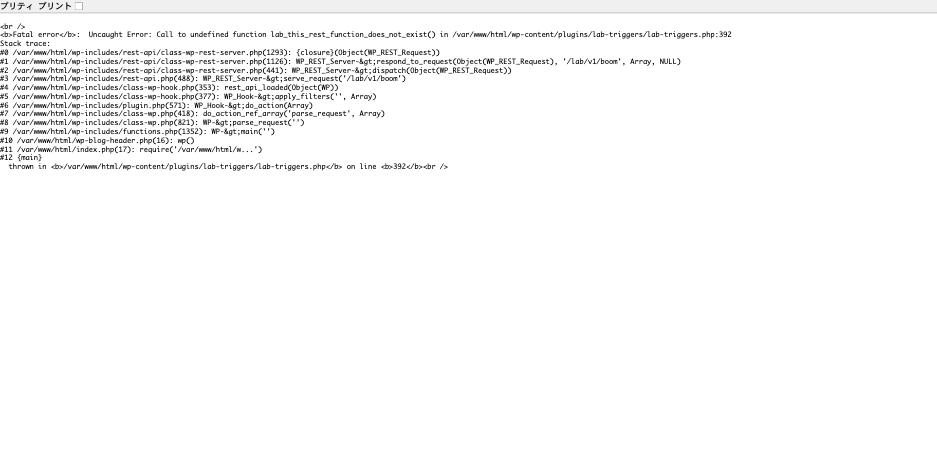

死活監視は全部グリーン。なのにサイトは壊れている。

WordPress の障害を種類ごとに再現して計測していたところ、**まったく別の原因の
4 つの障害が、どれも HTTP 200 を返す**という同じ結果になりました。原因は 1 つで、
仕組みが分かれば予防できます。

## 4 回とも 200 だった

いずれも `display_errors` が有効な状態での実測値です。

| 障害 | HTTP | 本文 |
|---|---|---|
| REST API 内で Fatal error | **200** | `Content-Type: application/json` なのに HTML のスタックトレース |
| データベースに接続できない | **200** | PHP の Warning + 接続エラー画面 |
| プラグイン競合で Fatal error | **200** | **272 バイト**（Fatal のメッセージだけ） |
| テーマの Fatal error | **200** | Deprecated + Fatal のスタックトレース |

最後の 2 つは**サイトが完全に死んでいます。**本文は数百バイトのエラー文だけで、
コンテンツは 1 文字もありません。それでもステータスは 200 です。

## 原因: ヘッダはやり直せない

HTTP レスポンスは、ステータス行とヘッダを送ってから本文を送ります。
一度送ったヘッダは取り消せません。

`display_errors` が有効だと、PHP はエラーメッセージを**本文として即座に
出力します。**その時点で「本文が始まった」ことになり、
**ステータスは 200 で確定します。**

WordPress はこの後で気づいて、エラーハンドラを動かします。
`WP_Fatal_Error_Handler` は本来 500 を設定して専用の画面を出す役ですが、
**ヘッダを送り終わったあとでは何もできません。**

同じことが層を変えて起きていました。

- REST API は、コールバックを呼ぶ**前に** `200 OK` と
  `Content-Type: application/json` を送り終えている
- DB 接続エラーは、`mysqli_real_connect()` の Warning が先に出力される
- プラグイン競合の `Cannot redeclare` は、プラグイン読み込み中に出力される
- テーマの Fatal も同様

**先に何か出力されたら、その後の障害はステータスに反映されません。**

## REST API は同じ Fatal でも 200、admin-ajax は 500

4 つのうち REST API だけは、`display_errors` の設定に関係なく 200 になります。
検証用プラグインで、未定義の関数を呼ぶだけの Fatal error を 2 つの経路に仕込んで
叩き比べました。エラーの内容は同一です。

| 経路 | HTTP | Content-Type | 本文 |
|---|---|---|---|
| `/wp-json/lab/v1/boom` | **200 OK** | `application/json` | HTML のスタックトレース |
| `/wp-admin/admin-ajax.php?action=lab_boom` | **500** | `text/html` | 「このサイトで重大なエラーが発生しました。」 |




REST 側のレスポンスは、ヘッダが JSON だと言っているのに中身は HTML でした。

```
HTTP/1.1 200 OK
Content-Type: application/json; charset=UTF-8
X-Powered-By: PHP/8.2.33
```

```html
<br />
<b>Fatal error</b>:  Uncaught Error: Call to undefined function ...
Stack trace:
#0 /var/www/html/wp-includes/rest-api/class-wp-rest-server.php(1293)
...
```

WordPress の REST サーバーは、**ルートのコールバックを呼ぶ前に**ステータス行と
ヘッダを送り終えています。一方 `admin-ajax.php` はヘッダを送る前に落ちるので、
エラーハンドラが介入でき、正しく 500 が返ります。
nginx + php-fpm と Apache + mod_php の両方で同じ結果でした。

REST ではさらに 2 つの問題が重なります。

- **クライアントは JSON のパースで落ちる。**`JSON.parse` の例外は
  「Unexpected token <」になり、サーバー側に原因があることが伝わりません
- **スタックトレースが外から見える。**エラーハンドラは画面の差し替えもできないため、
  ドキュメントルートの絶対パスとプラグイン構成がそのまま流れます

REST のコールバックを自作する場合は、中で例外を捕まえて `WP_Error` を返し、
ステータスを明示してください。

## 検証: display_errors を切ると 500 になる

同じ障害で `display_errors` だけを切って計測しました。

| `display_errors` | HTTP | 本文 |
|---|---|---|
| ON | **200** | エラーメッセージが見える |
| OFF | **500** | WordPress の「重大なエラー」画面 |

さらに WordPress のエラーハンドラも無効にすると、**本文 0 バイトの 500**
になります。いわゆる白画面です。

| `display_errors` | WP のハンドラ | HTTP | 本文 |
|---|---|---|---|
| ON | 有効 | 200 | エラーが見える |
| OFF | 有効 | 500 | 「重大なエラー」画面 |
| OFF | 無効 | **500** | **0 バイト** |
| ON | 無効 | 200 | 生のスタックトレース |

## 直感と逆の結論

ここが実務上いちばん大事な点です。

**画面にエラーを出す設定のほうが、監視は無力になります。**

- **白画面（何も見えない）は 500 で返る** → 監視で気づける
- **エラーが画面に見える状態は 200 で返る** → 監視は気づかない

「白画面はエラーが隠れている状態だから危ない」と思われがちですが、
**ステータスコードという観点では白画面のほうが正直**です。

本番で `display_errors` を切る理由は、情報漏洩の防止だけではありません。
**障害を 500 として正しく通知させるため**でもあります。

## 監視側でやるべきこと

ステータスコードだけを見る監視は、WordPress ではこの 4 パターンを取りこぼします。
追加すべき条件は次の 3 つです。

**1. 本文の長さを見る**

正常時と比べて極端に短ければ異常です。実測では死んでいる状態が 272 バイトで、
正常時は 25,000 バイト前後でした。閾値を置くだけで 4 パターンとも検知できます。

**2. 本文に特定の文字列が無いことを確認する**

`Fatal error` / `Parse error` / `重大なエラー` / `データベース接続確立エラー` を
含んでいたら異常とみなします。

**3. 期待する文字列が有ることを確認する**

サイト名やフッターの文字列など、正常時に必ず含まれるものを 1 つ選んで
「含まれていなければ異常」とします。こちらのほうが漏れが少ないです。

**API を監視するなら Content-Type と JSON のパースまで**

REST API は `Content-Type: application/json` のまま HTML を返していました。
ヘッダだけ見ても足りないので、実際にパースが通るかまで確認します。

## 診断側でやるべきこと

障害の連絡を受けたとき、**ステータスコードで安心してはいけません。**
本文の長さと中身を一緒に取ります。

```sh
curl -s -o /tmp/body -D /tmp/hdr -w 'HTTP %{http_code}\n' "https://example.com/"
wc -c < /tmp/body
grep -E 'Fatal error|Parse error|重大なエラー' /tmp/body
```

## 個別の事例

この記事は 4 つの障害に共通する仕組みだけを扱っています。
それぞれの切り分けは個別の記事にあります。

- [「データベース接続確立エラー」の原因を切り分ける](db-connection-error-diagnosis.md)
- [プラグインの競合](plugin-conflict-diagnosis.md)
- [PHP を上げたらサイトが白画面になった](php-upgrade-white-screen.md)
