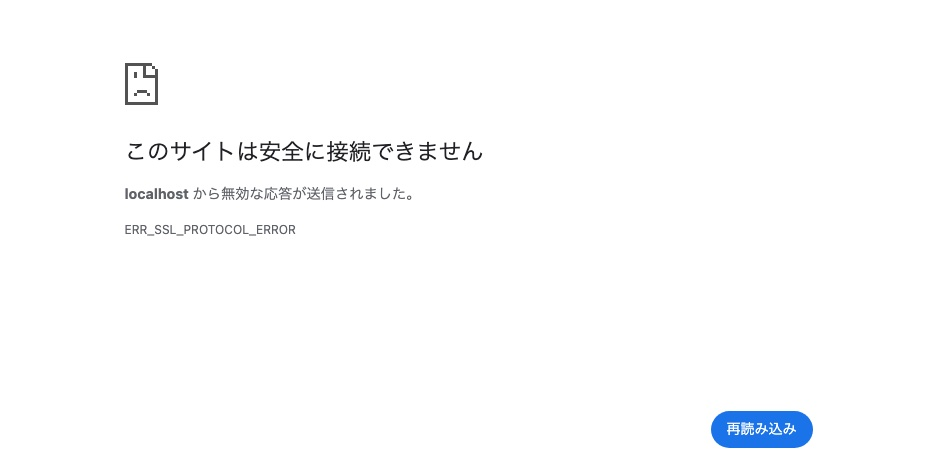
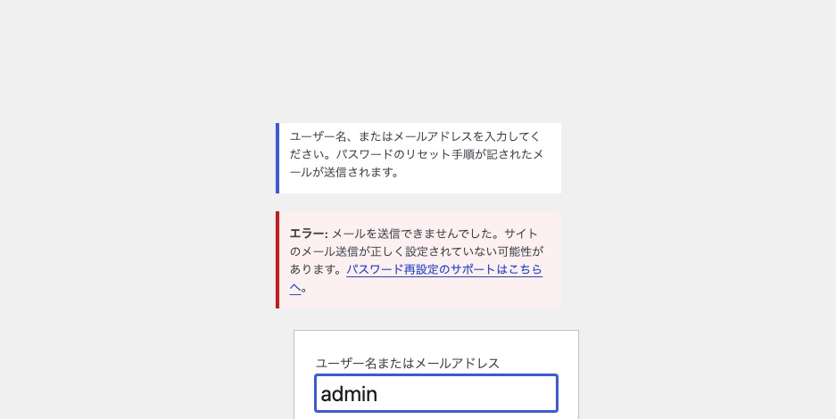

管理画面にログインできない。パスワードは合っているはずなのに。

「ログインできない」と言っても中身は別物です。**サイト自体は見えているか、
ログイン画面は出るか、どこで止まるか**で原因はほぼ絞れます。
4 パターンを再現して計測しました。

## まず切り分ける

| ログイン画面は | 押した後 | 疑うもの |
|---|---|---|
| 出る | 何も起きず画面が戻る | **Cookie が出ていない**（パターン 1） |
| 出ない（別 URL に飛ぶ・繋がらない） | — | **サイト URL の設定ミス**（パターン 2） |
| 出る | 「Cookie がブロックされています」 | Cookie（パターン 1 と同じ層） |
| 出る | パスワードを忘れてリセットできない | **メール送信の失敗**（パターン 3） |
| 出ない（500） | — | **テーマ・プラグインの Fatal**（パターン 4） |

いちばん速い確認方法は、ログイン画面で **`Set-Cookie` ヘッダが返っているか**を
見ることです。

```sh
curl -s -o /dev/null -D - "https://example.com/wp-login.php" | grep -i set-cookie
```

**0 件ならパターン 1 で確定します。**

## パターン 1: Cookie が出ていない

WordPress はログインの前に、テスト用の Cookie を置きます。
これが発行できないと、ログインは絶対に成功しません。

実測です。テーマの `functions.php` の末尾に空白を 1 つ足しただけの状態と、
正常な状態の比較です。

| | 正常 | 壊れている |
|---|---|---|
| サイト表示 | 200 | **200** |
| `/wp-login.php` の `Set-Cookie` | **1 個** | **0 個** |
| 正規化リダイレクト | 301 | **200**（効かない） |

**サイトは普通に表示されます。**壊れているのはヘッダを送る処理だけです。

原因は、PHP ファイルのどこかで**ヘッダより先に出力が始まっている**ことです。
`?>` の後ろの空白や改行、BOM、意図しない `echo` が該当します。

`debug.log` に場所が正確に出ます。

```
Warning: Cannot modify header information - headers already sent by
(output started at /path/to/wp-content/themes/xxx/functions.php:142)
```

**`output started at` の後ろが原因のファイルと行番号です。**
`WP_DEBUG_LOG` を有効にしていないと、この手がかりが得られません。

詳しくは [functions.php を壊したときの復旧](functions-php-broken-recovery.md) に
まとめました。

## パターン 2: サイト URL の設定ミス

**サイトは見えるのに管理画面だけ入れない**ときはこれです。
SSL を入れた直後に起きやすいものを再現しました。

WordPress 側の URL を `https://` にしたが、サーバーは HTTP しか
受けていない状態です。

| URL | 結果 |
|---|---|
| サイト | **200**（普通に見える） |
| `/wp-admin/` | **302 → `https://...`** |
| 転送先 | **接続できない**（SSL エラー） |

管理画面にアクセスすると HTTPS に転送され、そこで止まります。



*HTTPS を受けていないサーバーへ https で接続したときの Chrome の画面*
**フロントは無事なので「サイトは動いている」と誤診しやすいところです。**

逆方向のズレ（`http://` のままなのに実際は HTTPS）でも、
ログイン後にまた画面に戻される形のループになります。

### 直す場所を間違えやすい

`wp_options` の `siteurl` / `home` を phpMyAdmin で書き換える手順が
よく紹介されます。しかし **`wp-config.php` に定数があると DB の値は無視されます。**

実測では、DB を書き換えても実効値は変わりませんでした。

| | 値 |
|---|---|
| DB の `siteurl` / `home` | `http://127.0.0.1:8080` |
| **実際に使われた値** | **`http://localhost:8080`** |

```php
// wp-config.php にこれがあると DB より優先される
define( 'WP_HOME', 'http://localhost:8080' );
define( 'WP_SITEURL', 'http://localhost:8080' );
```

**管理画面の「設定 > 一般」で URL 欄がグレーアウトして編集できない場合は、
この定数があります。**直す場所は `wp-config.php` です。

## パターン 3: パスワードリセットのメールが来ない

「パスワードをお忘れですか？」から再設定しようとしても、メールが届かない。
これは**メール送信の設定が原因で、ログインの仕組みとは別の話**です。

WordPress の既定の送信元アドレスは `wordpress@<サーバー名>` です。
サーバー名にドットが含まれていないと、**PHPMailer が不正なアドレスとして
送信を中止します。**

実測です。送信元を修正する設定を外した状態と、有効な状態の比較です。

| | 送信元が不正 | 修正済み |
|---|---|---|
| POST 後の HTTP | **200** | 302 |
| メール受信 | **0 通** | 1 通 |
| 画面の表示 | 「**エラー: メールを送信できませんでした。サイトのメール送信が正しく設定されていない可能性があります。**」 | 「確認のリンクを含むメールを送信しました」 |



*送信元が不正な状態で「パスワードをお忘れですか？」から再設定を要求した画面*

画面に出るこの文言が手がかりです。**「送信しました」と出ているのに届かない
場合は WordPress 側は成功しているので、原因はサーバーの送信経路か
受信側の迷惑メール判定**です。切り分けが変わります。

詳しくは [WordPress からメールが届かない](wp-mail-not-delivered.md) に
まとめました。

### メールが使えないときの最終手段

phpMyAdmin が使えるなら、パスワードを直接書き換えられます。

```sql
UPDATE wp_users SET user_pass = MD5('新しいパスワード')
WHERE user_login = 'admin';
```

WordPress は MD5 のハッシュを見つけると、次のログイン時に
現行方式へ自動で作り直します。**作業後すぐに管理画面からパスワードを
再設定してください。**

## パターン 4: ログイン画面そのものが 500

`/wp-login.php` が 500 を返す場合、ログインの問題ではありません。
**テーマかプラグインが Fatal を起こしています。**

実測では、テーマの `functions.php` に構文エラーがあるとき、
サイト・`/wp-admin/`・`/wp-login.php` の**すべてが 500** になりました。
ブラウザからの入口が全部閉じます。

この状態からの復旧は、WP-CLI があるなら `--skip-themes` / `--skip-plugins`、
無いなら FTP でフォルダをリネームします。

- [functions.php を壊したときの復旧](functions-php-broken-recovery.md)
- [WP-CLI が無い環境での復旧](recovery-without-wp-cli.md)

## セキュリティプラグインが原因のこともある

実測はしていませんが、次のものは「パスワードは合っているのにログインできない」を
作ります。心当たりがあれば先に確認します。

- ログイン URL の変更（`/wp-login.php` が 404 になる）
  → [SiteGuard でログインできなくなった場合](siteguard-lockout.md)
- 二要素認証（端末を変えたら入れない）
- ログイン試行回数制限による IP ロック
- 国外 IP の遮断

いずれもプラグインのフォルダをリネームすれば解除できます。
[WP-CLI が無い環境での復旧](recovery-without-wp-cli.md) の手順が使えます。

## 確認の順番

```sh
# 1. どこで止まっているか
curl -s -o /dev/null -w 'top %{http_code}\n' https://example.com/
curl -s -o /dev/null -w 'login %{http_code}\n' https://example.com/wp-login.php
curl -s -o /dev/null -w 'admin %{http_code}\n' -D - https://example.com/wp-admin/ | grep -i location

# 2. Cookie は出ているか(0 ならパターン 1)
curl -s -o /dev/null -D - https://example.com/wp-login.php | grep -ci set-cookie
```

- ログイン画面が 500 → パターン 4
- 管理画面が別ホスト・別スキームに転送される → パターン 2
- `Set-Cookie` が 0 → パターン 1
- 全部正常に見えるのに入れない → パターン 3 かセキュリティプラグイン
