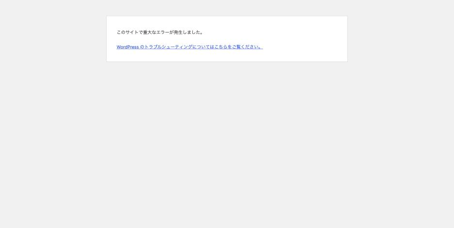
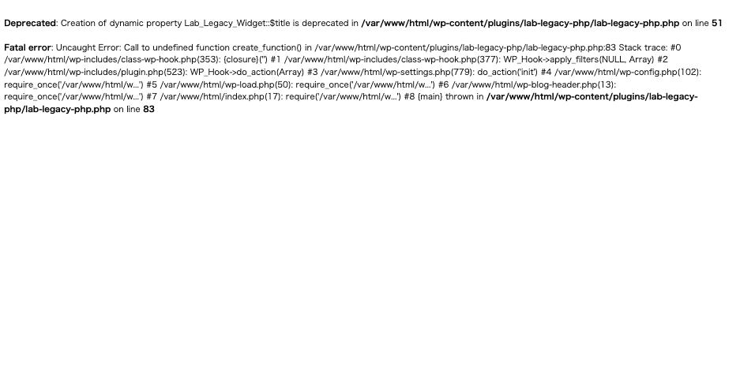

レンタルサーバーの管理画面で PHP のバージョンを上げた。その直後からサイトが
真っ白になり、管理画面にも入れない。

**白画面は「エラーが出ていない」状態ではありません。**エラーは出ているのに、
それを表示しない設定になっているだけです。設定の組み合わせを 4 通り作って
実測したので、何が見えて何が見えないのかを整理します。

## まず: 白画面になる条件は 1 つだけ

PHP 8 で削除された関数（`create_function()`）を呼ぶプラグインを有効にした状態で、
`display_errors` と WordPress のエラーハンドラを切り替えて計測しました。

| `display_errors` | WP のハンドラ | HTTP | 本文 | 訪問者が見るもの |
|---|---|---|---|---|
| ON | 有効 | **200** | 1248 bytes | PHP のエラーがそのまま出る |
| OFF | 有効 | **500** | 2742 bytes | 「このサイトで重大なエラーが発生しました。」 |
| OFF | 無効 | **500** | **0 bytes** | **何も出ない（ブラウザ自身のエラー画面）** |
| ON | 無効 | **200** | 1248 bytes | PHP のエラーがそのまま出る |

nginx + php-fpm と Apache + mod_php の両方で同じ結果でした。

白画面になるのは **`display_errors` が Off かつ WordPress のエラーハンドラが
無効**という 1 通りだけです。本番のレンタルサーバーはまさにこの組み合わせに
なりがちです。

なお「白画面」という呼び方は少し不正確でした。本文 0 バイトで HTTP 500 が返るため、
最近のブラウザは白いページではなく**ブラウザ自身のエラー画面**を出します。

## 2 つの中間状態を知っておくと切り分けが速い

### WordPress のエラーハンドラが生きている場合



「このサイトで重大なエラーが発生しました。」だけが出ます。**原因は書かれません**が、
この画面が出ているなら WordPress のコードは動いていて、Fatal を捕まえられた
ということです。このときは管理者宛にリカバリーモードの復帰メールが飛びます。

### display_errors が有効な場合



```
Deprecated: Creation of dynamic property Lab_Legacy_Widget::$title is deprecated in
/var/www/html/wp-content/plugins/lab-legacy-php/lab-legacy-php.php on line 51

Fatal error: Uncaught Error: Call to undefined function create_function() in
/var/www/html/wp-content/plugins/lab-legacy-php/lab-legacy-php.php:83
Stack trace: #0 .../class-wp-hook.php(353): {closure}('') ...
```

**原因のプラグイン名とファイル、行番号がすべて出ます。**切り分けとしては
これが最速です。ただし HTTP ステータスは **200** になります。

## ステータスが 200 になる理由

`display_errors` が有効だと、PHP はエラーメッセージを**レスポンス本文として
先に出力します**。その時点で `200 OK` のヘッダが確定してしまうため、あとから
WordPress のエラーハンドラが 500 を設定しようとしても書き換えられません。

つまり:

- **`display_errors` を有効にすると、サイトが死んでいても監視は 200 を受け取る**
- 逆に切っておけば 500 が返り、監視で気づける

「白画面（何も見えない）」と「監視で気づける」は両立します。むしろ、
**画面にエラーを出す設定のほうが監視は無力になります。**
これは [REST API の Fatal error が 200 で返る](http-200-when-site-is-down.md)のと、
[データベース接続エラーが 200 で返る](db-connection-error-diagnosis.md)のと、まったく同じ機構です。

## バージョンを上げると何が増えるのか

同じコードを PHP 8.1 / 8.2 / 8.4 で動かして、`debug.log` に出る非推奨警告を
数えました。1 リクエストあたりの件数です。

| PHP | 件数 | 内容 |
|---|---|---|
| 7.4 | **0** | — |
| 8.1 | **0** | — |
| 8.2 | **2** | `Using ${var} in strings is deprecated` / `Creation of dynamic property … is deprecated` |
| 8.4 | **3** | 上記 + `Implicitly marking parameter $limit as nullable is deprecated` |

いずれも **Deprecated なので動作は止まりません。**サイトは 200 で表示されます。
しかし `debug.log` が肥大化し、アクセスが多いサイトではディスクを食い潰します。
「PHP を上げたらログが急に増えた」の中身はこれです。

特に **動的プロパティの非推奨（8.2）** は、宣言していないプロパティに代入する
という古い書き方全般に当たるため、実在プラグインで最も多く踏まれます。

## 落とし穴: opcache が警告を隠す

非推奨警告には 2 種類あり、**片方は 1 回しか出ません。**

3 回連続でアクセスしたときの `debug.log` の件数:

| 警告 | 種類 | 3 リクエストでの件数 |
|---|---|---|
| `Creation of dynamic property` | 実行時 | **3** |
| `Using ${var} in strings` | コンパイル時 | **0** |

`${var}` の警告はファイルをコンパイルしたときにだけ出ます。opcache が
コンパイル結果を持っている間は、二度と出ません。実際に opcache をリセットして
から 1 回アクセスすると、また 1 件だけ出ました。

**PHP を上げた直後に 1 回だけ出た警告を、後から調べても再現しません。**
調査するときは opcache をリセットしてから 1 回目のアクセスのログを見ます。

```sh
php -r 'opcache_reset();'     # または php-fpm / Apache を再起動する
```

## 切り分けの手順

1. **`display_errors` を一時的に有効にする**。原因のファイルと行番号が出るので最速
   （ただし訪問者にも見えるので、作業後すぐ戻す）
2. 触れない場合は `debug.log` を見る。`WP_DEBUG_LOG` が有効なら Fatal も記録される
3. **WordPress のエラーハンドラを無効にすると、WP の汎用画面ではなく生の
   スタックトレースが出る**。プラグイン名を特定できるのはこちら

```php
// wp-config.php
define( 'WP_DISABLE_FATAL_ERROR_HANDLER', true );
define( 'WP_DEBUG', true );
define( 'WP_DEBUG_LOG', true );
define( 'WP_DEBUG_DISPLAY', false );  // 訪問者には見せない
```

この組み合わせが実務では一番使いやすいです。画面は白いままですが、
`debug.log` に生のトレースが残ります。

## 戻し方

**PHP のバージョンを戻すのが最短です。**ただし後述の通り、戻せないことがあります。

Web が死んでいても WP-CLI は動くので、原因のプラグインを止められます。

```sh
wp plugin deactivate <slug>
wp plugin deactivate --all      # 原因が不明なとき
```

## WP-CLI が無い環境では

原因のプラグインを止めるだけなら FTP でフォルダをリネームできます。
手順は [WP-CLI が無い環境での復旧](recovery-without-wp-cli.md)。

## 7.4 で動いていたコードが 8 系で落ちる

同じコードを PHP 7.4 と 8.2 で動かして比較しました。
`create_function()`（PHP 7.2 で非推奨、**8.0 で削除**）を呼ぶコードです。

| | PHP 7.4 | PHP 8.2 |
|---|---|---|
| HTTP | **200** | Fatal error |
| 本文 | 25,248 bytes（正常） | 272 bytes（エラー文のみ） |
| `debug.log` | `Deprecated: Function create_function() is deprecated`（1 件） | `Fatal error: Uncaught Error: Call to undefined function create_function()` |
| 処理結果 | **成功**（計算結果の `42` が保存された） | 実行されない |

**7.4 では警告が 1 行出るだけで正常に動きます。**
そして 8.0 以降では同じコードが Fatal になります。

つまり **非推奨警告は「いつか壊れる」の予告**です。
7.4 の時点で `debug.log` に 1 行出ていたものが、上げた瞬間にサイトを落としました。
**上げる前に `debug.log` を読んでいれば防げた**ということになります。

### 上げる前にやること

対象のコードを本番と同じ内容で、**現在のバージョンのまま**動かして
`debug.log` を確認します。

```sh
# opcache をリセットしてから 1 回アクセスし、警告を数える
php -r 'opcache_reset();'   # または php-fpm を再起動
: > wp-content/debug.log
curl -s -o /dev/null https://example.com/
grep -c Deprecated wp-content/debug.log
```

**`Deprecated` が出ているプラグインやテーマは、次のメジャーバージョンで
落ちる候補**です。件数がゼロなら、少なくとも既知の非推奨は踏んでいません。

## 古い PHP の環境を作るには

検証やロールバックのために古い PHP を建てようとすると、
**apt が失敗して詰まります。**EOL を過ぎたリリースは、
基盤 Debian のパッケージがミラーから消えているためです。

```
E: Release file for .../bullseye-security/InRelease is expired
E: Failed to fetch .../libicu-dev_67.1-7+deb11u1_amd64.deb  404  Not Found
```

有効期限の検査を外してもパッケージ自体が無いので解決しません。

### 解決策: snapshot.debian.org

公式の PHP イメージには、**`snapshot.debian.org` を指す行がコメントで
同梱されています。**これを有効化するだけで解決します。
snapshot はその時点のパッケージ状態を凍結保存しているアーカイブです。

```dockerfile
RUN set -eux; \
    if ! apt-get update > /dev/null 2>&1; then \
        sed -i -e 's|^# deb http://snapshot|deb http://snapshot|' \
               -e 's|^deb http://deb.debian.org|# deb http://deb.debian.org|' \
               /etc/apt/sources.list; \
        printf 'Acquire::Check-Valid-Until "false";\n' \
            > /etc/apt/apt.conf.d/99no-check-valid-until; \
        apt-get update; \
    fi

RUN apt-get install -y --no-install-recommends ...
```

**apt が通る間は通常のミラーを使い、失敗したときだけ snapshot に切り替わる**
書き方にしておけば、新しいバージョンにも古いバージョンにも同じ Dockerfile で
対応できます。

これで PHP 7.4.33 が建ち、拡張モジュール（gd / mysqli / pdo_mysql / zip /
exif / intl / opcache）も 8 系と同じ構成で揃いました。
**同じ拡張構成でないと、バージョン差ではなくビルド差で挙動が変わってしまいます。**

### それでも「戻す」を前提にしない

環境は作れますが、**レンタルサーバー側の選択肢からは消えていきます。**
非推奨警告が出ている間に直すのが本筋で、
古い環境は「原因を切り分けるための一時的な比較対象」と考えるのが安全です。

## 再現手順

```sh
# バージョンを切り替える(.env の PHP_VERSION)。イメージの再ビルドが必要
# 7.4 のような EOL 版でも snapshot.debian.org 経由で建てられる
docker compose build php apache
docker compose up -d --no-deps --force-recreate php apache
docker compose restart nginx      # php の IP が変わるので nginx も再起動する

# 非推奨警告の件数を数える
: > src/wp-content/debug.log
curl -s -o /dev/null "http://localhost:8080/"
grep -c Deprecated src/wp-content/debug.log

# Fatal を踏む(検証用プラグインを有効にしてフラグを立てる)
wp plugin activate lab-legacy-php
touch src/wp-content/lab-legacy-fatal
rm    src/wp-content/lab-legacy-fatal    # 戻す
```

`--force-recreate` で php コンテナを作り直すと IP が変わり、nginx が古い解決結果を
握ったままになって 502 が出ます。`docker compose restart nginx` で直ります。
