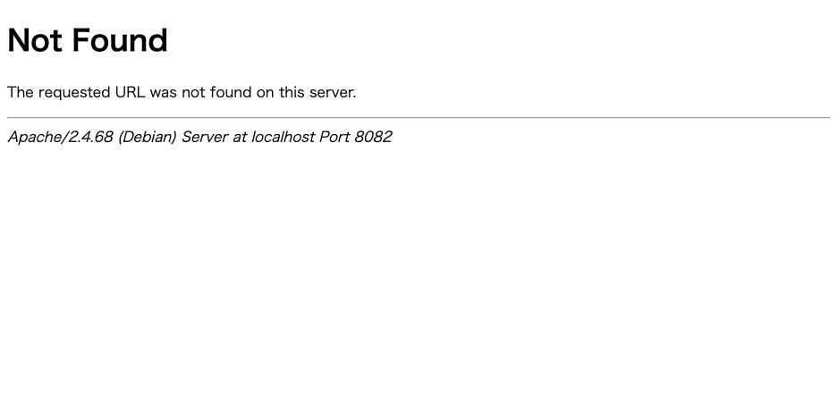

トップページは表示されるのに、記事を開くと 404 になる。固定ページもカテゴリも 404。
管理画面は普通に使える。

対処法として「設定 > パーマリンク」を開いて保存し直す、と書かれています。
**それは正しいのですが、何をしているのか説明されていません。**
そして**保存し直しても直らないことがあります。**実測しました。

## 実測: 404 になるのは Apache だけ

`.htaccess` を削除した状態で、同じ URL を 2 つの Web サーバーから叩きました。

| URL | nginx | Apache |
|---|---|---|
| トップ | 200 | **200** |
| 投稿 | 200 | **404** |
| 固定ページ | 200 | **404** |
| カテゴリ | 200 | **404** |
| `/?p=38`（旧形式） | 301 | **301** |
| `/wp-admin/` | 302 | **302** |

**nginx は影響を受けません。**ルーティングをサーバーの設定ファイルで行っているためです。
`.htaccess` を読むのは Apache だけなので、**レンタルサーバー（ほぼ Apache）でだけ起きます。**

トップページと管理画面が生きているのもポイントです。
「サイトは動いているのに記事だけ見えない」という報告になります。

## 決定的な手がかり: どちらの 404 か

これが最速の切り分けです。返ってきた 404 の**中身**を見ます。

```
<title>404 Not Found</title>
Not Found
```

実測では **Apache 自身の 404 ページ**が返っていました。WordPress のテーマの
404 ページではありません。



*.htaccess が無い状態で投稿を開いた画面。デザインが無く、最下行にサーバーの名前が出る*

| 見えた 404 | 意味 |
|---|---|
| **サーバーの 404**（`Apache/2.4.x Server at ...` などが出る） | WordPress まで到達していない。`.htaccess` かサーバー設定の問題 |
| **WordPress の 404**（テーマのデザイン、サイト名が出る） | 到達している。投稿が無いか、パーマリンク構造とデータの不一致 |

**デザインされた 404 ページが出ているなら、`.htaccess` は無罪です。**
この 1 点だけで調べる場所が半分になります。

## 「保存し直す」が何をしているのか

パーマリンク設定の画面を開いて保存を押すと、WordPress は
**`.htaccess` のリライト規則を書き直します。**

コマンドで言えばこれと同じです。

```sh
wp rewrite flush --hard
```

実測では、`.htaccess` が存在しない状態からこれを実行したら、
**598 バイトのファイルが新規作成され、投稿が 200 に戻りました。**

つまり「保存し直す」の実体は、**設定の保存ではなくファイルの書き出し**です。
設定値は何も変わっていません。

## 保存し直しても直らない場合

ここが本題です。`.htaccess` が**書き込めない**とき、
WordPress は書き込みに失敗しますが、**成功したように見えます。**

`.htaccess` を読み取り専用（444）にして実行した結果です。

```
Warning: fopen(/var/www/html/.htaccess): Failed to open stream: Permission denied
         in /var/www/html/wp-admin/includes/misc.php on line 175
Success: Rewrite rules flushed.
```

**`Success` と表示されます。**しかしファイルの中身は変わっていません
（わざと壊しておいた `RewriteBase /WRONG/` がそのまま残りました）。

管理画面から操作した場合は、WordPress が
**「手動で書き換える必要があります」というメッセージと、貼り付け用のコードを表示します。**
このメッセージが出ているときは、保存ボタンを押しても何も起きていません。

### 確認すること

- `.htaccess` のパーミッション（644 が標準。**604 や 444 では書けません**）
- ファイルの所有者が Web サーバーの実行ユーザーと合っているか
- ディレクトリ自体が書き込み可能か（`.htaccess` が存在しない場合は新規作成になる）

書けないなら、**表示されたコードを FTP で貼り付けるのが正解**です。
権限を緩めるより安全です。

## `.htaccess` が無くても動く設定

実測で `/?p=38` は 301 で正常に動きました。**ID ベースの URL はリライト規則を
必要としません。**

同じ理屈で、パーマリンク構造を `/index.php/%postname%/` のように
`index.php` を含む形にすると、`.htaccess` 無しでも動きます。
URL は少し不格好になりますが、**`.htaccess` が使えない環境での回避策**になります。

## nginx でも起きる別の問題

nginx は `.htaccess` を無視しますが、**サーバー設定の書き方次第で特定の URL だけ
404 になります。**実測で見つけた例です。

| URL | nginx | Apache |
|---|---|---|
| `/robots.txt` | **404** | **200** |

原因は nginx の設定にこう書かれていたことです。

```nginx
location = /robots.txt { log_not_found off; access_log off; }
```

この `location` ブロックには `try_files` も `fastcgi_pass` もありません。
**静的ファイルを探して、無ければ 404 で終わります。**WordPress が動的に生成する
仮想 `robots.txt` には永久に到達しません。

よく配られる設定例にそのまま入っている書き方です。直すには 1 行足します。

```nginx
location = /robots.txt { try_files $uri /index.php?$args; access_log off; log_not_found off; }
```

**「WordPress が生成するはずのファイルが 404」**という症状は、
`robots.txt` だけでなく `wp-sitemap.xml` などでも同じ原因で起きます。
→ [RSS とサイトマップだけ壊れる](feed-sitemap-broken.md)

## 切り分けの順番

1. **404 の見た目を確認する** — サーバーの 404 か、テーマの 404 か
2. サーバーの 404 なら `.htaccess` の有無と中身を見る（404 ではなく 500 なら → [.htaccess で 500 エラー](htaccess-500-rewrite-loop.md)）
3. パーマリンク設定を保存し直す（= `.htaccess` の再生成）
4. **「手動で書き換える必要があります」が出たら、権限の問題**。貼り付け用コードを FTP で書き込む
5. テーマの 404 なら `.htaccess` は無罪。投稿の公開状態やパーマリンク構造を見る

## 再現手順

```sh
cp src/.htaccess /tmp/htaccess.bak
rm src/.htaccess

curl -o /dev/null -w '%{http_code}\n' http://localhost:8082/2026/09/12/post-31/   # 404
curl -o /dev/null -w '%{http_code}\n' http://localhost:8080/2026/09/12/post-31/   # 200
curl -s http://localhost:8082/2026/09/12/post-31/ | grep -i "<title>"              # Apache の 404

wp rewrite flush --hard          # = パーマリンクを保存し直す
ls -l src/.htaccess              # 再生成される

# 書き込めない場合
chmod 444 src/.htaccess
wp rewrite flush --hard          # Warning が出るが Success と表示される
chmod 644 src/.htaccess

cp /tmp/htaccess.bak src/.htaccess
```
