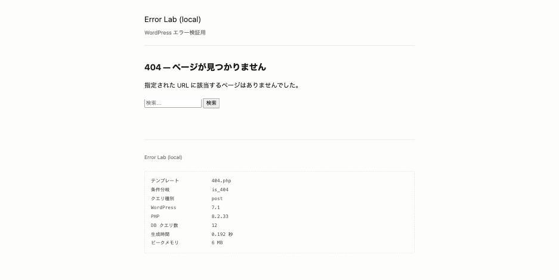
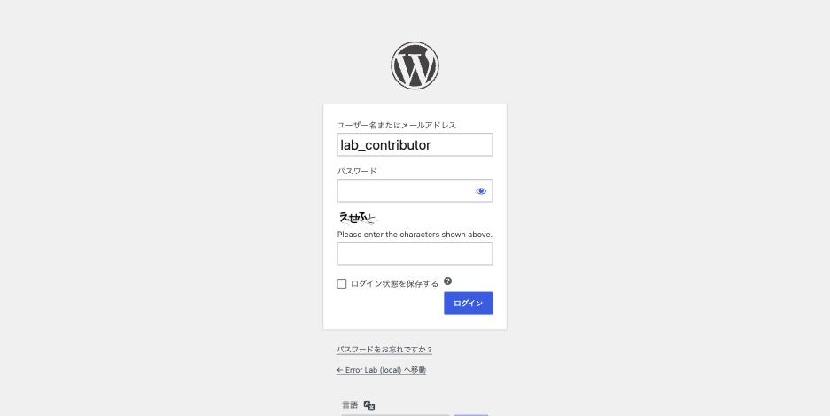
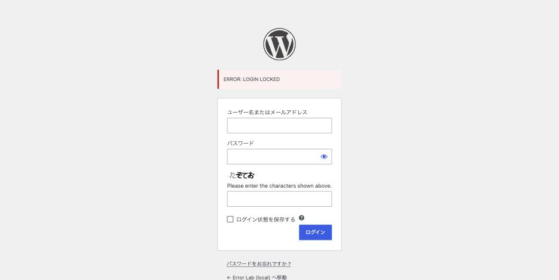

SiteGuard WP Plugin は国内のレンタルサーバーが標準で導入していることが多く、
**「入れた覚えがないのに入っている」**プラグインです。そして
**有効化した瞬間にログイン URL が変わる**ため、ログインできなくなる相談が絶えません。

実際にインストールして、何がどう変わるのかを計測しました（バージョン 1.8.9）。

## 有効化した瞬間に何が起きるか

| | 有効化前 | 有効化後 |
|---|---|---|
| `/wp-login.php` | **200** | **404** |
| `/wp-admin/` | 302 | 302 |
| トップページ | 200 | 200 |
| `/xmlrpc.php` | 405 | 405（変化なし） |
| `.htaccess` | — | **変更されない** |

`wp-login.php` は**その場で 404 になります。**返ってくるのは
WordPress の 404 ページ（21,203 bytes）で、サーバーの 404 ではありません。

**サイトの表示には何の影響もありません。**気づくのは次にログインしようとしたときです。
SiteGuard を入れていないのにログインできない場合は → [ログインできない時の症状別の見分け方](login-impossible.md)



*`wp-login.php` はテーマの 404 ページを返す。サーバーの 404 ではない*

## 新しいログイン URL は `/wp-admin/` が教えてくれる

いちばん重要な発見です。多くの解説記事は
「メールを探す」「データベースを見る」「FTP でプラグインを消す」と書いていますが、
**もっと簡単な方法があります。**

`/wp-admin/` にアクセスすると、リダイレクト先に新しい URL が入っています。

```
$ curl -s -o /dev/null -D - http://example.com/wp-admin/ | grep -i location
Location: http://example.com/login_14569.php?redirect_to=...&reauth=1
```

**ブラウザで `/wp-admin/` を開くだけで、新しいログイン画面に飛ばされます。**
URL を覚えていなくても、そこから入れます。

### URL の形は `/login_数字5桁.php`

実測した値です。

```
renamelogin_path = login_14569
→ 実際の URL は http://example.com/login_14569.php
```

**末尾に `.php` が付きます。**`/login_14569/` のようなディレクトリ形式で試すと
404 になります（最初にこれで詰まりました）。

`.htaccess` には何も書かれず、WordPress のリライト規則にも登録されていません。
プラグインが PHP の処理中に判定しています。
**つまり `.htaccess` を消しても元に戻りません。**

## 復帰の手段（上から順に試す）

| 手段 | 方法 |
|---|---|
| **1. `/wp-admin/` を開く** | リダイレクト先が新しいログイン URL。**まずこれ** |
| 2. メールを探す | 有効化時に管理者宛に新 URL が送られる（件名に「ログインページ変更」） |
| 3. データベースを見る | `wp_options` の `siteguard_config` 内の `renamelogin_path` |
| 4. WP-CLI | `wp plugin deactivate siteguard` |
| 5. FTP | `wp-content/plugins/siteguard` をリネーム |

**4 と 5 はプラグインを止めるので、セキュリティ設定が全部外れます。**
FTP でのリネーム手順は [FTP と phpMyAdmin だけで復旧する方法](recovery-without-wp-cli.md) にあります。
1 で入れるなら、そちらのほうが安全です。

なお 3 の値は直列化されているので、SQL で見るより WP-CLI が簡単です。

```sh
wp eval 'echo get_option("siteguard_config")["renamelogin_path"], "\n";'
```

### 補足: この機能の防御力は限定的

`/wp-admin/` が新 URL を教えてくれるということは、
**攻撃側も同じ方法で新 URL を知れます。**
ログイン URL の変更は「自動化された総当たりのノイズを減らす」効果はありますが、
狙って調べる相手には有効ではありません。

実際に効いているのは、次のログインロックと画像認証です。

移動先のログイン画面には、既定で画像認証が付いています。



## ログインロックの実挙動

設定の既定値です。

| 項目 | 既定値 |
|---|---|
| 判定期間（`loginlock_interval`） | **5 秒** |
| 失敗回数のしきい値（`loginlock_threshold`） | **3 回** |
| ロック時間（`loginlock_locksec`） | **60 秒** |

誤ったパスワードで連続して試して計測しました。

```
1回目: ERROR: Please check your input and try again.
2回目: ERROR: Please check your input and try again.
3回目: ERROR: Please check your input and try again.
4回目: ERROR: LOGIN LOCKED      ← ここから
5回目: ERROR: LOGIN LOCKED
```

**5 秒以内に 3 回失敗すると、4 回目以降が `ERROR: LOGIN LOCKED` になります。**



*メッセージは英語で出る。日本語で検索しても情報が出てこない理由がこれ*

解除までの時間も測りました。

| 最後の失敗からの経過 | 結果 |
|---|---|
| 直後 | **ロック中** |
| 16 秒 | **ロック中** |
| 30 秒 | **ロック中** |
| （30 秒の試行から）さらに 40 秒 | **解除** |

設定値の 60 秒どおりでした。ただし重要な点があります。

**ロック中に試すと、その時点から 60 秒を数え直します。**

実測では、30 秒後に 1 回試したことで解除が後ろにずれました。
**焦って何度もログインを試すほど、待ち時間が延びます。**
これは利用者に伝えておく価値があります。**1 分待ってから 1 回だけ試す**のが正解です。

### 記録は IP 単位

```
ip_address       status  count  last_login_time
192.168.65.1     3       3      2026-09-12 17:35:19
```

`wp_siteguard_login` というテーブルに **IP ごと**に記録されます。
ユーザー名ではありません。

つまり **社内の共有回線やモバイル回線で複数人が使っていると、
他人の失敗で自分もロックされます。**「自分は間違えていないのにロックされる」
場合はこれです。

ロックを手で解除するなら、この行を消します。

```sql
DELETE FROM wp_siteguard_login WHERE ip_address = '自分のIP';
```

## エラーメッセージが統一されている

実在するユーザー名と、存在しないユーザー名で試した結果です。

| 入力したユーザー名 | メッセージ |
|---|---|
| `admin`（実在） | `ERROR: Please check your input and try again.` |
| `nosuchuser_xyz`（存在しない） | **同一** |

WordPress の既定では「ユーザー名が存在しません」と「パスワードが違います」を
区別して返すため、**ユーザー名が実在するかを攻撃側に教えてしまいます。**
SiteGuard はこれを統一します（`same_login_error`）。

セキュリティとしては正しい挙動ですが、**運用時は不便です。**
「ユーザー名が違うのかパスワードが違うのか分からない」という問い合わせの原因になります。

**メッセージが英語で出る**点も注意です。
`ERROR: LOGIN LOCKED` や `Please check your input and try again.` で検索しても
日本語の情報が出てこないため、調査が止まりがちです。

## 既定でオフの機能（通説と違うところ）

「SiteGuard を入れたから対策済み」と思われがちな機能が、**既定では無効**でした。

| 機能 | 既定 |
|---|---|
| 画像認証（CAPTCHA） | **有効** |
| ログインロック | **有効** |
| ログインページ変更 | **有効** |
| ログイン詳細エラーメッセージの無効化 | **有効** |
| ログインアラート（メール通知） | **有効** |
| **フェールワンス** | **無効** |
| **管理ページアクセス制限** | **無効** |
| **XML-RPC 無効化** | **無効** |
| **REST API 無効化** | **無効** |
| **ユーザー名漏洩防止** | **無効** |
| 更新通知 | **無効** |

とくに次の 2 点は誤解されやすいところです。

- **フェールワンス**（正しいパスワードでも 1 回目は必ず失敗させる機能）は
  **既定では無効**です。「SiteGuard を入れると 1 回目は必ず失敗する」という説明を
  見かけますが、有効化した場合の話です。実測でも `loginlock_fail_once = 0` でした
- **XML-RPC と REST API は塞がれていません。**`/xmlrpc.php` は有効化前後とも
  405 で変化なしでした（Pingback の無効化だけが既定で有効）

**有効にすると別の問題が起きる**ので、既定が無効なのは妥当です。

| 有効にすると起きること |
|---|
| 管理ページアクセス制限 → **IP が変わると自分も入れない**（モバイル回線、動的 IP、VPN） |
| XML-RPC 無効化 → アプリからの投稿、Jetpack、外部連携が止まる |
| REST API 無効化 → ブロックエディタが動かなくなる（除外設定が必要） |
| フェールワンス → 「パスワードが合っているのに弾かれる」問い合わせが増える |

REST API を無効化する場合の除外リストは、既定で
`oembed,contact-form-7,akismet` が入っていました。
**Contact Form 7 が名指しで除外されている**のは、
そうしないとフォームが動かなくなるためです。

## 画像認証の一時ファイルが溜まる

計測中に気づいた点です。画像認証を表示するたびに、
`wp-content/siteguard/` に画像とスクリプトのペアが作られます。

20 回ほどログインを試した結果、**74 個のファイル**が残りました。
そして**プラグインを削除してもこのディレクトリは残りました。**

アンインストール後に手で消す必要があります。

```sh
rm -rf wp-content/siteguard
```

長く運用しているサイトでは、ここにファイルが溜まっている可能性があります。

## まとめ

**ログインできなくなったら、まず `/wp-admin/` を開く。**それで新しい
ログイン画面に飛べます。プラグインを消す必要はありません。

**ロックされたら 1 分待って 1 回だけ試す。**何度も試すと待ち時間が延びます。

**「SiteGuard を入れたから安全」ではありません。**
XML-RPC も REST API も既定では塞がれていないので、
必要なら個別に有効化します（ただし副作用があります）。

## 再現手順

```sh
wp plugin install siteguard --activate

curl -o /dev/null -w '%{http_code}\n' http://localhost:8080/wp-login.php   # 404
curl -s -o /dev/null -D - http://localhost:8080/wp-admin/ | grep -i location
# → Location: .../login_XXXXX.php  ← 新しい URL

wp eval 'echo get_option("siteguard_config")["renamelogin_path"], "\n";'

# ログインロック(誤ったパスワードで 4 回)
for i in 1 2 3 4; do
  curl -s -X POST "http://localhost:8080/login_XXXXX.php" \
    --data-urlencode "log=nosuchuser" --data-urlencode "pwd=wrong" --data "wp-submit=login" \
   | grep -oE "LOGIN LOCKED|Please check your input" | head -1
done

mysql -e "SELECT * FROM wp_siteguard_login;"

wp plugin deactivate siteguard && wp plugin delete siteguard
rm -rf wp-content/siteguard          # 削除しても残るので手で消す
```

## 参考にした情報源

- [SiteGuard WP Pluginが原因でWordPressにログインできないときの対処法](https://dcome.co.jp/siteguard-wp-plugin/)
- [【SiteGuard WP Plugin】導入後にWordPressの管理画面にログインできない理由と対処法](https://hukuroublog.jp/loginurl-forget-step/)
- [SiteGuard WP Pluginの設定方法と不具合対処【404/403エラー】](https://wp-search.org/ja/blog/wordpress-start-siteguard/)
