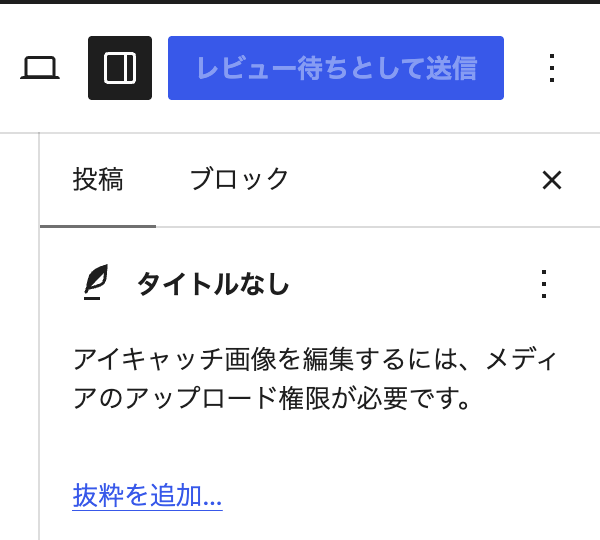
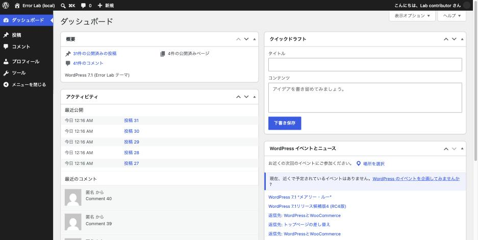

「管理画面が開けない」と言われて見に行くと、画面にはこの一行だけ。

> このページにアクセスする権限がありません。

どの権限が足りないのか、この画面からは分かりません。**WordPress は原因の
権限名を一切出しません。**実測して確かめた内容と、権限側から切り分ける手順を
まとめます。

## 落ちた権限が違っても、返る画面は同一

購読者（subscriber）でログインした状態で、3 つの管理ページを開きました。
それぞれ必要な権限は別物です。

| URL | 必要な権限 | HTTP |
|---|---|---|
| `options-general.php` | `manage_options` | 403 |
| `plugins.php` | `activate_plugins` | 403 |
| `edit.php` | `edit_posts` | 403 |
| `upload.php` | `upload_files` | 403 |
| `profile.php` | `read` | 200（開ける） |

返ってきた画面は、4 つとも完全に同じでした。スクリーンショットを撮って
ハッシュを取ると一致します。

```
f2ff1f5e190b668506cf2b2f9e3fb859  options-general.php
f2ff1f5e190b668506cf2b2f9e3fb859  plugins.php
```

別の権限で弾かれているのに、返るバイト列が同じ。そして `debug.log` には
**何も出力されません。**画面もログも情報を持っていないということです。

なお、ステータスコードは 403 です。ただし画面には出ないので、
アクセスログを見ないと 403 なのか 200 なのかも分かりません。

## 未ログインの場合は挙動が違う

ログインしていない状態で同じ URL を叩くと、403 ではなく **302** で
ログイン画面に飛ばされます。

```
/wp-admin/options-general.php
  → 302 /wp-login.php?redirect_to=...&reauth=1
```

つまり「403 が返っている」= **ログインは成功していて、権限が足りない**
という切り分けになります。ここは画面を見なくても判断できる材料です。
ログインそのものができない場合は → [ログインできない時の症状別の見分け方](login-impossible.md)

そもそも誰にどのロールを割り当てるかを決めたい場合は
→ [ユーザー権限をどう割り当てるか](role-design.md)

## 権限側から調べる

画面に情報が無いので、ユーザーが持っている権限を直接見ます。

```sh
wp user list-caps lab_contributor
# edit_posts read level_1 level_0 delete_posts contributor
```

「何ができないか」を知りたいときは、ロール同士の差分を取るのが速いです。

```sh
wp eval '
$c = get_role("contributor")->capabilities;
$a = get_role("author")->capabilities;
echo implode(", ", array_keys(array_diff_key($a, $c)));'
# upload_files, edit_published_posts, publish_posts, level_2, delete_published_posts
```

寄稿者（contributor）は投稿者（author）に対して、この 5 つが無い。
「画像がアップロードできない」「公開できない」の原因がこれで確定します。
管理者なのにアップロードに失敗する場合は、権限ではなくサーバー側の問題です。
→ [画像をアップロードできない](media-upload-failure.md)

## もっと厄介なケース: 権限不足がエラーにならない

寄稿者で投稿画面を開くと、**エラーも 403 もログも出ないまま、UI が静かに
変わります。**

- 「公開」ボタンが **「レビュー待ちとして送信」** になる
- アイキャッチ欄が「アイキャッチ画像を編集するには、メディアのアップロード権限が
  必要です。」という案内に置き換わる
- 管理メニューの項目が減る（寄稿者で 5 項目、購読者で 2 項目）



これは仕様どおりの正常動作です。しかし利用者からは「公開ボタンが無くなった」
「画像が入れられない」という問い合わせになります。

**この手の問い合わせは、エラー調査では絶対に見つかりません。**
エラーログにも、アクセスログの 4xx にも、何も残っていないからです。
最初からロールと権限を見るしかありません。

## 切り分けの順番

1. アクセスログでステータスを確認する。**403 ならログイン済みで権限不足、
   302 なら未ログイン**
2. `wp user list-caps <user>` でそのユーザーの権限を出す
3. 期待するロールとの差分を取る
4. エラーが一切出ていないなら、権限不足による UI 変化を疑う

## 再現手順

権限別のユーザーを作って、順に管理画面を叩きます。

```sh
wp user create lab_contributor lab_contributor@example.test \
   --role=contributor --user_pass='...'

# ログインして各 URL を開く。ステータスはアクセスログで見る
tail -f logs/nginx/access.log
```


